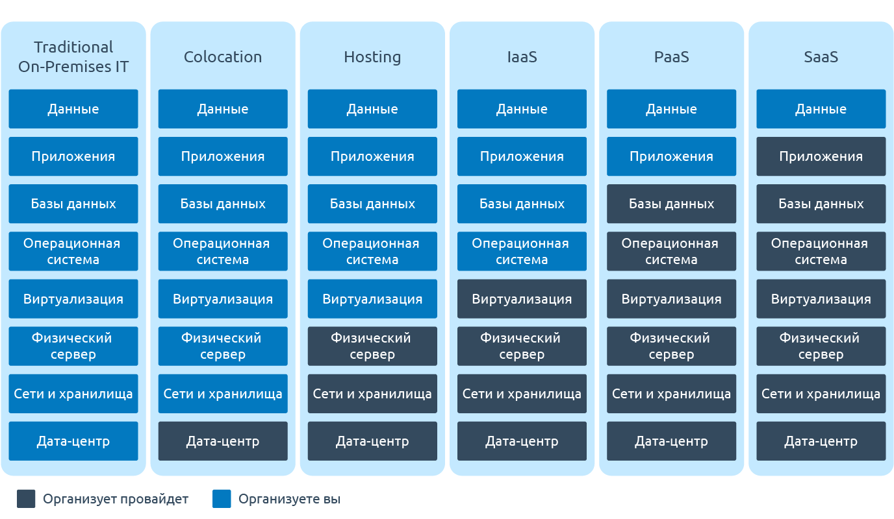

## Clouds

1. В чем разница между IaaS, PaaS и SaaS?

    

      
Ответ

    IaaS, PaaS и SaaS это основные модели предоставления облачных услуг:

    * в IaaS клиент получает только инфраструктуру
    * в PaaS инфраструктуру и подготовленное для разработки приложений ПО
    * в SaaS готовое работающее в облаке приложение

    

    <https://www.ispsystem.ru/news/xaas>

    

