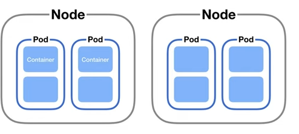
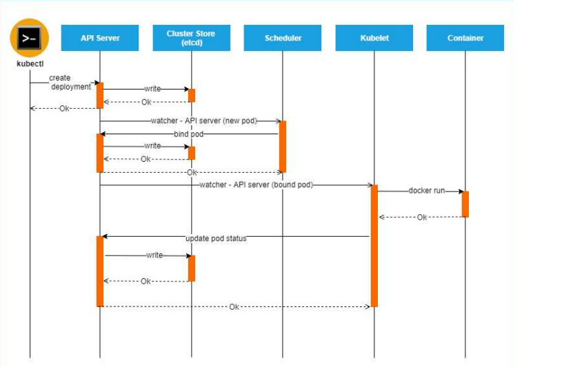
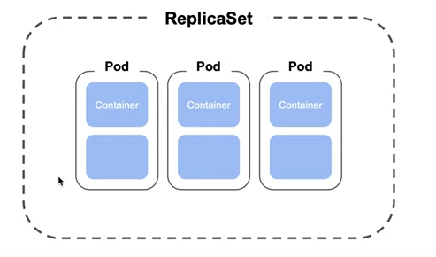

## Kubernetes

1. Что такое Kubernetes?

    <details>
      <summary>Ответ</summary>

    Это система управления кластерами контейнеров Linux. Kubernetes позволяет выполнять оркестрацию контейнеризированных приложений, то есть запуск, управление, масштабирование и обновление контейнеров на на большом количестве хостов.

    </details>

---

2. Какие задачи решает Kubernetes?

    <details>
      <summary>Ответ</summary>

    1. Запуск и масштабирование приложений на большом количестве хостов.
    2. Балансировка приложений между хостами.
    3. Автоматизация работы с приложениями.
    4. Упрощение логирования, мониторинга и сбора метрик.
    5. Повышение эффективности работы DevOps/SRE за счёт понятного и удобного API.
    6. Упрощение настройки и поддержки CI/CD.     

    </details>

---

3. Что такое Minikube?

    <details>
      <summary>Ответ</summary>

    Локальный кластер для знакомства с Kubernetes и тестирования каких-либо решений.

    </details>

---

4. Чем отличается Kubernetes от Openshift?

    <details>
      <summary>Ответ</summary>

    https://www.redhat.com/cms/managed-files/cl-openshift-and-kubernetes-ebook-f25170wg-202010-en.pdf

    1. Openshift имеет более строгие политики безопасности и модели аутентификации.
    2. Openshift поддерживает полную интеграцию CI/CD Jenkins.
    3. Openshift имеет веб-консоль по умолчанию. В Kubernetes консоль необходимо дополнительно устанавливать.
    4. В Kubernetes возможно устанавливать сторонние сетевые плагины. В Openshift используется собственное сетевое решение Open vSwitch, которое предоставляет три различных плагина.
    5. Kubernetes может быть установлен практически на любой дистрибутив Linux. Openshift имеет ограничения на устанавливаемые дистрибутивы, преимущественно используются RedHat-дистрибутивы.
    6. Kubernets доступен в большинстве облачных платформ - GCP, AWS, Azure, Yandex.Cloud. Openshift доступен на облачной платформе Azure и в облаке от IBM.
    7. По умолчанию, в Opemshift поды в кластере запускаются только под обычным пользователем, чтобы запустить под под пользователем root, необходимо выдать права для сервисного аккаунта. В Kubernetes по умолчанию поды запускаются по пользователем root.

    </details>

---

5. Что такое узел, нода?

    <details>
      <summary>Ответ</summary>
    Это физическая или виртуальная машина, являющаяся частью кластера Kubernetes.
    Ноды бывают двух типов, Master и Worker:
    
    * Master используется для размещения управляющих и координирующих элементов в кластере.
    * Worker используется непосредственно для рабочей нагрузки.

    В Minikube и Master, и Worker запускаются на одном хосте.
    
    </details>
    
---

6. Что находится на Master-ноде?

    <details>
      <summary>Ответ</summary>

      * Kube-apiserver, отвечает за оркестрацию всех операций кластера.
      * Controller-manager (Node controller + Replication Controller), отвечает за функции контроля за нодами, репликами.
      * ETCD cluster (распределенное хранилище ключ-значение), хранит информацию о кластере и его конфигурации.
      * Kube-sheduler, отвечает за определение ноды, на которой нужно разместить под.

    По умолчанию, на Master-ноде не размещаются контейнеры приложений, но данный фунционал возможно настроить. Если необходимо использовать компоненты Kubernetes в контейнерах, на Master-ноде также устанавливается Docker.

    </details>

---

7. Что находится на Worker-ноде?

    <details>
      <summary>Ответ</summary>

      * Kubelet, слушает инструкции от kube-apiserver и разворачивает или удаляет контейнеры на нодах.
      * Kube-proxy, отвечает за взаимодействие между сервисами на разных нодах кластера.

    На Worker-нодах по умолчанию размещаются контейнеры приложений. На каждой ноде кластера устанавливается Docker или другая платформа контейнеризации (например RKT или Containterd). 

    </details>

---

8. Как выглядит отказоустойчивая конфигурация кластера Kubernetes?

    <details>
      <summary>Ответ</summary>
    Отказоустойчивая конфигурация кластера Kubernetes должна состоять минимум из трёх Master-нод и трёх Worker-нод, размещённых на разных гипервизорах в ЦОД. Если нужно запустить больше, чем три Master-ноды, их количество должно быть нечётным, так как для кворума ETCD нужно, чтобы в кластере присутствовало как минимум более половины живых нод. При этом, количество Worker-нод должно быть пропорционально количеству Master-нод. 
    </details>

---

9. Что такое Pod?

    <details>
      <summary>Ответ</summary>

    Минимальная единица приложения в Kubernetes. Представляет собой запрос на запуск одного или более контейнера на одной ноде кластера. Контейнеры в поде имеют общий доступ к ресурсам, таким как тома хранилища данных и сетевой стек. Каждый под имеет свой собственный внутренний API.
    
    

    </details>

---

10. Какое минимальное и максимальное количество контейнеров может содержать Pod?

    <details>
      <summary>Ответ</summary>

    В любом поде присутствует pause-контейнер, который отвечает за выделение ресурсов и сетевую связность между контейнерами внутри пода. Поэтому, в поде с работающим приложением присутствуют два контейнера: pause-контейнер и непосредственно контейнер с приложением. Максимальное количество контейнеров в поде зависит от доступного количества ресурсов на хосте. Верхнего предела количества контейнеров в поде нет.

    </details>

---

11. Какое количество контейнеров в Pod является оптимальным?

    <details>
      <summary>Ответ</summary>

    Общая рекомендация - чем меньше контейнеров приложений в поде, тем лучше. В идеале, в каждом поде должно быть по одному контейнеру приложений. В некоторых случаях может потребоваться запустить два или три контейнера приложений в поде. Например, если несколько приложений взаимосвязаны друг с другом настолько, что не могут быть запущены по отдельности. 

    </details>

---

12. Может ли Pod запуститься на двух разных нодах кластера?

    <details>
      <summary>Ответ</summary>

    Нет. Под это минимальная единица приложения в кластере

    </details>
    
---

13. Как запустить Pod в кластере Kubernetes?

    <details>
      <summary>Ответ</summary>

    Для запуска абстракций Kubernetes нужно установить и настроить [Kubectl](https://kubernetes.io/ru/docs/tasks/tools/install-kubectl/) на рабочем компьютере.
    После этого нужно создать файл манифеста с расширением yaml. Пример файла манифеста nginx-pod.yaml, запускающего под с nginx:

    ```yml
    apiVersion: v1           # Версия API, используемая кластером Kubernetes для запуска данного манифеста
    kind: Pod                # Тип сущности, описанной манифестом. В данном случае это Pod           
    metadata:
      name: nginx-pod        # Имя пода
    spec:                    # В блоке spec описываются атрибуты создаваемого пода
      containers:
      - name: nginx          # Имя контейнера
        image: nginx:1.22    # Имя образа контейнера. Никогда не используйте тег latest, старайтесь всегда явно указывать версии приложений
        ports:               # Открытые порты
        - containerPort: 80
    ```

    Затем, необходимо запустить под при помощи команды:

    ```bash
    kubectl apply -f nginx-pod.yaml
    ```

    Проверить состояние запущенного пода можно при помощи команды:

    ```bash
    kubectl get pods
    ```

    </details>

---

14. Как создается под? Какие компоненты задействуются при его создании?

    <details>
      <summary>Ответ</summary>

    На каждом worker-узле развёрнуто три компонента: Kubelet, CRI, Kube-proxy. Kubelet это модуль коммуникации воркера с Kube-API. CRI - Container Runtime Engine, окружение для запуска контейнеров. Kube-proxy - компонент для взаимодействия с другими узлами кластера. При создании нового пода задействуется команда kubectl, например ```kubectl apply -f pod.yaml```. В файле pod.yaml описаны параметры запускаемого пода. Запрос от kubectl уходит на Kube-API. Параметры для доступа к Kube-API указаны в настройках kubectl. Kube-API выполняет аутентификацию хоста, откуда пришёл запрос, а также валидирует запрос. Далее, Kube-API отправит запрос в Etcd чтобы проверить, что записи о таком поде нет в кластере. Etcd это источник правды для кластера Kubernetes. Если запись отсутствует, то она будет добавлена в Etcd. После этого Kube-API обращается к планировщику ресурсов, который определяет, на какой из нод можно развернуть новый под. После этого Kube-API отправляет запрос в Kubelet ноды, указанной планировщиком. Kubelet, взаимодействия с CRI, создаёт под.

    

    Подробно процесс обработки команд Kubernetes описан здесь:

    <https://habr.com/ru/company/flant/blog/342658/>

    <https://habr.com/ru/company/flant/blog/342822/>

    </details>

---

15. Что такое Sidecar?

    <details>
      <summary>Ответ</summary>

      Sidecar это паттерн проектирования приложений, при котором основной функционал приложения дополняется новым функционалом, развёрнутым в отдельном контейнере внутри пода. Таким образом, в поде присутствует не два контейнера (pause-контейнер, контейнер приложения), а три контейнера (pause-container, контейнер приложения, sidecar-контейнер). Подход полезен при работе с легаси, которое страшно трогать лишний раз. Однако, для масштабирования приложения без sidecar-контейнера придётся делать отдельный деплоймент.

    </details>

---

16. Что такое ReplicaSet?

    <details>
      <summary>Ответ</summary>

      Следующий уровень абстракции над подами. ReplicaSet запускает определённое количество подов и гарантирует поддержание данного количества подов в запущенном состоянии на кластере. Поды, запущенные при помощи ReplicaSet могут работать на разных нодах кластера.
      
      
      
      В спецификации указываем количество реплик.

    </details>

---

17. Чем отличаются *ReplicationController* от *ReplicaSet*?

    <details>
      <summary>Ответ</summary>

    ReplicationController гарантирует, что указанное количество реплик подов будут работать одновременно. Другими словами, ReplicationController гарантирует, что под или набор подов всегда активен и доступен.

    ReplicaSet - это следующее поколение ReplicationController. Разница в том, что ReplicaSet поддерживает множественный выбор в селекторе (environment in prod, test), тогда как для ReplicationController нужно точное соответствие селектора (environment = production).
    </details>

---

18. Как запустить ReplicaSet в кластере Kubernetes?

    <details>
      <summary>Ответ</summary>

    Нужно создать файл манифеста с расширением yaml. Пример файла манифеста nginx-replicaset.yaml, запускающего ReplicaSet с двумя подами nginx:

    ```yml
    apiVersion: apps/v1             # Версия API, используемая кластером Kubernetes для запуска данного манифеста
    kind: ReplicaSet                # Тип сущности, описанной манифестом. В данном случае это ReplicaSet
    metadata:
      name: nginx-replicaset        # Имя репликасета
    spec:
      replicas: 2                   # Количество запущенных подов
      selector:
        matchLabels:
          app: nginx-replicaset     # Селектор для поиска подов. При помощи селекторов репликасет понимает, какие поды в него входят, а какие не входят
      template:                     # Шаблон пода, который управляется при помощи данного репликасета
        metadata:
          labels:
            app: nginx
        spec:                       # В блоке spec описываются атрибуты создаваемого репликасета
          containers:
            - name: nginx           # Имя контейнера
              image: nginx:1.22     # Имя образа контейнера. Никогда не используйте тег latest, старайтесь всегда явно указывать версии приложений
              ports:                # Открытые порты
                - containerPort: 80
    ```
      
    Затем, необходимо запустить репликасет при помощи команды:

    ```bash
    kubectl apply -f nginx-replicaset.yaml
    ```

    Проверить состояние запущенного пода можно при помощи команды:

    ```bash
    kubectl get replicasets
    ```

    Вывод такой команды:
      
    ```bash
    user@workstation:~/kuber_manifests$ kubectl get replicasets -o wide
    NAME               DESIRED   CURRENT   READY   AGE   CONTAINERS   IMAGES       SELECTOR
    nginx-replicaset   2         2         2       10m   nginx        nginx:1.22   app=nginx-replicaset
    ```

    * Name - имя запущенного репликасета
    * Desired - ожидаемое количество подов, согласно манифесту nginx-replicaset.yaml
    * Current - реальное количество запущенных подов
    * Ready - количество подов, готовых к работе
    * Age - время с момента запуска репликасета
    * Containers - контейнеры, запущенные в подах репликасета
    * Images - образы, из которых запущены контейнеры
    * Selector - метка, при помощи которой определяется принадлежность контейнеров к данному репликасету

    </details>

---  

19. Можно ли при помощи ReplicaSet обновить версию приложения?

    <details>
      <summary>Ответ</summary>

    Для обновления версий приложений используется Deployment, абстракция над ReplicaSet. Пытаться обновлять версии приложений при помощи ReplicaSet не рекомендуется.

    </details>

---

20. Если на каждой ноде Kubernetes кластера нужно запустить контейнер, то какой ресурс Kubernetes вам подойдет?

    <details>
      <summary>Ответ</summary>

    DaemonSet. Это контроллер, основным назначением которого является запуск подов на всех нодах кластера. Если нода добавляется/удаляется — DaemonSet автоматически добавит/удалит под на этой ноде.

    DaemonSet подходят для запуска приложений, которые должны работать на всех нодах, например — экспортёры мониторинга и сбор логов.

    </details>

---

21. Как поды разнести на разные ноды?

    <details>
      <summary>Ответ</summary>

    Необходимо настроить podAntiAffinity. Данный параметр определяет, что определённые поды следует размещать на разных нодах.

    </details>

--- 

22. В облаке есть три зоны доступности. Как сделать так, чтобы поды приложения распределились по этим зонам доступности равномерно?

    <details>
      <summary>Ответ</summary>

    Необходимо настроить [podAntiAffinity](https://kubernetes.io/docs/concepts/scheduling-eviction/assign-pod-node/#an-example-of-a-pod-that-uses-pod-affinity). Либо, более новый вариант для данной задачи, настроить [topologySpreadConstraints](https://kubernetes.io/docs/concepts/scheduling-eviction/topology-spread-constraints/) с указанием ключа лейбла зон.

    </details>

---

23. Как контейнеры одного пода разнести на разные ноды?

    <details>
      <summary>Ответ</summary>

    Никак. Под - минимальная и неделимая сущность. Kubernetes оперирует подами, а не отдельными контейнерами. 

    </details>

---

24. Как обеспечить, чтобы поды никогда не перешли в состояние Evicted на ноде? 

    <details>
      <summary>Ответ</summary>

    Когда узлу (node) кластера не хватает памяти или дискового пространства, он активирует флаг, сигнализирующий об этой проблеме. Флаг блокирует любое новое выделение ресурсов на ноде и запускает процесс "выселения" (Eviction) подов с ноды. В этот момент Kubelet начинает освобождать ресурсы, удаляя контейнеры и маркируя поды как Failed, пока использование ресурсов снова не станет ниже порога "выселения". Сначала Kubelet пытается освободить ресурсы узла путем удаления мертвых модулей и их контейнеров, а также неиспользуемых образов. Если этого недостаточно, Kubelet начинает выселять поды конечных пользователей в следующем порядке уровней QoS:

    1. Best Effort (поды, для которых не заданы реквесты и лимиты вообще).
    2. Burstable (поды, для которых указан реквест CPU или памяти хотя бы для одного контейнера), использующие больше ресурсов, чем запрос истощенного ресурса.
    3. Burstable, использующие меньше ресурсов, чем запрос истощенного ресурса.

    Чтобы под не был удален при "выселении", необходимо настроить политики QoS для пода как Guaranteed.

    Подробнее в документации Kubernetes: [Create a Pod that gets assigned a QoS class of Guaranteed](https://kubernetes.io/docs/tasks/configure-pod-container/quality-service-pod/#create-a-pod-that-gets-assigned-a-qos-class-of-guaranteed)

    Кроме того, можно использовать сущность Kubernetes под названием PodDisruptionBudget, которая позволит регулировать количество вытесняемых подов и обеспчивать гарантированную доступность для конкретного микросервиса https://kubernetes.io/docs/tasks/run-application/configure-pdb/

    </details>

---

25. За что отвечает Kube-proxy?

    <details>
      <summary>Ответ</summary>

    Kube-proxy отвечает за сетевое взаимодействие между сервисами на разных нодах кластера.

    </details>

---

26. Как установить Kubernetes?

    <details>
      <summary>Ответ</summary>

    1. Следовать инструкции [установки kubeadm](https://kubernetes.io/docs/setup/production-environment/tools/kubeadm/install-kubeadm/).

    2. Установка с [использованием kubespray](https://github.com/kubernetes-sigs/kubespray).

    </details>

---

27. Чем отличается *StatefulSet* от *Deployment*?


    <details>
      <summary>Ответ</summary>

    *Deployment* - ресурс Kubernetes, предназначенный для развертывания приложения без сохранения состояния. При использовании PersistentVolumeClaim все реплики будут использовать один и тот же том, и ни один из них не будет иметь собственного состояния.

    *StatefulSet* - поддерживают сохранение состояния приложений за пределами жизненного цикла отдельных подов. Используется для приложений с отслеживанием состояния, каждая реплика приложения будет иметь собственное состояние и будет использовать свой собственный том. StatefulSet, в отличие от Deployment невозможно мигрировать на соседние ноды, так как в StateFulSet указан каталог хоста, который смонтирован в файловую систему пода.

    </details>

---

28. Что такое *операторы* в терминологии Kubernetes?

    <details>
      <summary>Ответ</summary>

    Операторы это программные расширения Kubernetes, призванные автоматизировать выполнение рутинных действий с объектами кластера при определённых событиях. Оператор работает по подписке на события API Kubernetes. Тип используемого оператора указывается в манифесте yaml в поле Kind.

    </details>

---

29. Что такое Service?

    <details>
      <summary>Ответ</summary>
    
    Service это абстракция, обеспечивающая сетевой доступ к поду снаружи. Service заставляет прокси пересылать запросы на набор контейнеров. IP-адреса подов постоянно меняются, а Service предоставляет сетевой доступ к приложению, работающему на группе подов, а также балансирует запросы к ним.

    </details>
    
---

30. Какие типы Service бывают?

    <details>
      <summary>Ответ</summary>

    * Без селекторов.
    * ClusterIP - Сервису выделяется отдельный IP-адрес внутри кластера. Режим работы по умолчанию Доступ извне можно настроить с помощью проксирования.
    * NodePort - выделяется IP-адрес на всех нодах кластера, через который можно получить доступ к сервису. Порт выделяется из диапазона 30000 - 32767.
    * LoadBalancer - работает только в облачном кластере (AWS, Azure, GCP) и использует внешний IP-адрес. Он уже перенаправляет трафик на NodePort и ClusterIP, которые создаются автоматически.
    * ExternalName - перенаправление трафика через cname-запись в DNS-кластере.

    </details>

---

31. Как создать Service?

    <details>
      <summary>Ответ</summary>

    * ```kubectl expose deployment DEPLOYMENTNAME --type=ClusterIP --port PORTNUMBER```

    </details>

---

32. Что такое Ingress?

    <details>
      <summary>Ответ</summary>

    Оверлейная сеть, перенаправляющая внешний трафик на поды в кластере Kubernetes.

    </details>
    
---

33. Что такое Egress?

    <details>
      <summary>Ответ</summary>

    Оверлейная сеть, перенаправляющая трафик с подов на внешнюю сеть, к которой подключен Kubernetes. По своей сути Egress выполняет ту же функцию, что и Ingress, но в обратном направлении.

    </details>
    
---

34. Почему *DaemonSet* не нужен Scheduler?

    <details>
      <summary>Ответ</summary>

    DaemonSet гарантирует, что определенный под будет запущен на всех нодах кластера. При наличии DaemonSet в кластере, на любой из существующих и будущих нод зарезервированы ресурсы для пода. Scheduler же позволяет запускать поды по расписанию.

    Здесь стоит сделать оговорку, что DaemonSet может работать не на всех нодах кластера, а на некоторых, выбранных, например, по nodeSelector. Это может быть полезно в случае наличия GPU нод в кластере, чтобы микросервис, использующий GPU, деплоился только на эти ноды.

    </details>

---

35. В каких случаях не отработает перенос пода на другую ноду?

    <details>
      <summary>Ответ</summary>

    Если на другой ноде нет ресурсов для размещения пода или нет сетевой доступности до ноды.

    </details>

---

36. Что делает *ControllerManager*?

    <details>
      <summary>Ответ</summary>

    Controller выполняет постоянный процесс мониторинга состояния кластера и различных компонент.

    ControllerManager (Node controller + Replication Controller) отвечает за функции контроля за нодами, репликами.

    </details>

---

37. Администратор выполняет команду `kubectl apply -f deployment.yaml`. Опишите по порядку, что происходит в каждом из узлов Kubernetes и в каком порядке?

    <details>
      <summary>Ответ</summary>

    Клиент Kubectl обращается к мастер-серверу Kube-Apiserver (стандартно на порт 6443), адрес мастер-сервера задан в *.config* файле Kubectl. В запросе передаётся информация из манифеста deployment.yaml, которую нужно применить в кластере обращения. API-сервер обращается к Etcd-хранилищу, проверяет наличие конфигурации запрашиваемого ресурса. Если конфигурация в хранилище Etcd есть, API-сервер сравнивает новую конфигурацию с конфигурацией в базе данных. Если конфигурация одинаковая, то изменений в кластере не происходит, клиенту отдается ответ об успешности запрашиваемого действия. Если конфигурации нет в Etcd, то если требуемое действие касается создания сущностей, которые требуют ресурсов кластера (создания подов, хранилища pv/pvc и т.д.), Scheduler проверяет возможность размещения подов на нодах и после чего происходит создание подов, при этом ControllerManager  контроллирует создание нужного поличества реклик сущности. После создания требуемой сущности происходит запись в Etcd. ControllerManager продолжает отслеживать состояние сущностей на протяжении всего цикла их жизни.

    </details>

---

38. Как выполнить обновление Kubernetes в контуре где нет интернета?

    <details>
      <summary>Ответ</summary>

    Предварительно с рабочего кластера с новой версией Kubernetes и доступом в Интернет необходимо скачать требуемые пакеты kubeadm и образы api, controllmanager, etcd, scheduler, kubelet, docker-ce. Скачать пакеты с разрешением зависимостей возможно командой `yumdownloader --resolve kubeadm`. Образы скачиваются локально в архив `docker save <имя_образа> > <имя_образа>`.tar.

    1. Удалить приложения из кластера.
    ```bash
    helm delete --purge all
    ```

    2. После того, как все необходимые компоненты скачены и загружены в контур без Интернета, выполняет команду сброса kubeadm.
    ```bash
    kubeadm reset
    ```

    3. Удаляем CNI-плагин Kubernetes.
    ```bash
    yum remove kubernetes-cni-plugins
    ```

    4. Локально устанавливаем необходимые пакеты.
    ```bash
    yum install ./kubernetes_packages/*.rpm
    ```

    5. Загружаем образы сервисов Kubernetes.
    ```bash
    docker load < <имя_образа>.tar
    ```

    6. Отключаем SELinux.
    ```bash
    setenforce 0
    sed -i 's/^SELINUX=enforcing$/SELINUX=permissive/' /etc/selinux/config
    ```

    7. Определяем IP адрес master сервера.
    ```bash
    IP=$(ip route get 1 | awk '{print $NF;exit}')
    ```

    8. Инициализируем кластер Kubernetes.
    ```bash
    kubeadm init --apiserver-advertise-address=$IP
    ```

    9. Далее необходимо установить CNI-плагин, например Weave.

    10. Разрешить на master ноде запускать контейнеры приложения.
    ```bash
    kubectl taint nodes --all node-role.kubernetes.io/master-
    ```

    На worker ноде выполняются аналогичные действия, кроме того, что устанавливается только kubelet. При инициализации master ноды выдаётся token для подключения worker нод, его необходимо сохранить, чтобы позже включить woker ноду в кластер.

    </details>

---

39. Чем Router в Openshift отличается от Ingress в Kubernetes?

    <details>
      <summary>Ответ</summary>

    Router Openshift использует haproxy, как прокси-вебсервер. Ingress как в Kubernetes, так и OpenShift может быть разным (nginx, haproxy, caddy, etc).

    </details>

---

40. Почему для установки Kubernetes требуется отключить swap?

    <details>
      <summary>Ответ</summary>

    Планировщик Kubernetes определяет наилучший доступный узел для развертывания вновь созданных модулей. Если в хост-системе разрешена подкачка памяти, это может привести к проблемам с производительностью и стабильностью в Kubernetes. По этой причине Kubernetes требует, чтобы вы отключили swap в хост-системе.

    </details>

---

41. Сколько контейнеров запускается в одном поде?

    <details>
      <summary>Ответ</summary>

    По умолчанию при запуске одного контейнера в одном поде запускается еще *pause* контейнер. Итого, в одном поде может быть запущено *n+1* контейнеров.

    </details>

---

42. Для чего нужен *pause* контейнер в каждом поде?

    <details>
      <summary>Ответ</summary>

    Контейнер *pause* запускается первым в поде и создаёт сетевое пространство имен для пода. Затем Kubernetes выполняет CNI плагин для присоединения контейнера *pause* к сети. Все контейнеры пода используют сетевое пространство имён (netns) этого *pause* контейнера.

    </details>

---

43. Чем в OpenShift отличается *Deployment* от *DeploymentConfig*

    <details>
      <summary>Ответ</summary>

    https://docs.openshift.com/container-platform/4.1/applications/deployments/what-deployments-are.html

    </details>

---

44. Для чего нужны *Startup*, *Readiness*, *Liveness* пробы? Чем отличаются?

    <details>
      <summary>Ответ</summary>

    Kubelet использует **Liveness** пробу для проверки, когда перезапустить контейнер. Например, Liveness проба должна поймать блокировку, когда приложение запущено, но не может ничего сделать. В этом случае перезапуск приложения может помочь сделать приложение доступным, несмотря на баги.

    Kubelet использует **Readiness** пробы, чтобы узнать, готов ли контейнер принимать траффик. Pod считается готовым, когда все его контейнеры готовы.

    Одно из применений такого сигнала - контроль, какие Pod будут использованы в качестве бекенда для сервиса. Пока Pod не в статусе ready, он будет исключен из балансировщиков нагрузки сервиса.

    Kubelet использует **Startup** пробы, чтобы понять, когда приложение в контейнере было запущено. Если проба настроена, он блокирует Liveness и Readiness проверки, до того как проба становится успешной, и проверяет, что эта проба не мешает запуску приложения. Это может быть использовано для проверки работоспособности медленно стартующих контейнеров, чтобы избежать убийства kubelet'ом прежде, чем они будут запущены.

    </details>

---

45. Чем отличаются *Taints* и *Tolerations* от *Node Afiinity*?

    <details>
      <summary>Ответ</summary>

    *Node Affinity* - это свойство подов, которое позволяет нодам выбирать необходимый под. Node Affinity позволяет ограничивать для каких узлов под может быть запланирован, на основе меток на ноде. Node Affinity требует указания nodeSelector для пода с необходимым label ноды кластера.

    Типы Node Affinity:
    `<Требование 1><Момент 1><Требование 2><Момент 2>
    requiredDuringSchedulingRequiredDuringExecution`

    | Тип \ Момент | DuringScheduling | DuringExecution |
    |-|-|-|
    | Тип 1 | Required | Ignored |
    | Тип 2 | Preferred | Ignored |
    | Тип 3 | Required | Required |

    Существуют определенные операторы nodeAffinity: In, NotIn, Exists, DoesNotExist, Gt или Lt.

    *Taints* - это свойство нод, которое позволяет поду выбирать необходимую ноду. Tolerations применяеются к подам и позволяют (но не требуют) планировать модули на нодах с соответствующим Taints.

    Установить для ноды Taints:

    ```bash
    kubectl taint nodes <node-name> key=value:taint-effect
    ```
    Taint-effect принимает значения - NoSchedule, PreferNoSchedule, NoExecute.

    Пример:

    ```bash
    kubectl taint nodes node1 app=blue:NoSchedule
    ```

    - NoSchedule означает, что пока в спецификации пода не будет соответствующей записи tolerations, он не сможет быть развернут на ноде (в данном примере node10).

    - PreferNoSchedule— упрощённая версия NoSchedule. В этом случае планировщик попытается не распределять поды, у которых нет соответствующей записи tolerations на ноду, но это не жёсткое ограничение. Если в кластере не окажется ресурсов, то поды начнут разворачиваться на этой ноде.

    - NoExecute — этот эффект запускает немедленную эвакуацию подов, у которых нет соответствующей записи tolerations.

    Taints и Tolerations работают вместе, чтобы гарантировать, что поды не запланированы на несоответствующие ноды. На ноду добавляется один или несколько Taints и это означает, что нода не должна принимать никакие поды, не относящиеся к Taints.

    Taints и Tolerations не гарантирует, что определенный под будет размещен на нужной ноде. NodeAffinity - не гарантирует, что на определенной ноде, кроме выбранных подов, не будет размещены другие поды. 

    </details>

---

46. Чем отличаются *Statefulset* и *Deployment* в плане стратегии обновления подов Rolling Update?

    <details>
      <summary>Ответ</summary>

    Стратегия обновления Rolling Update в **Deployment** предполагает последовательное обновление подов: сначала будет создан новый под, затем будет переключен трафик на новый под и затем удален старый под.

    Стратегия обновления Rolling Update в **StatefulSet** предполагает обновление подов в обратном порядке, то есть под сначала будет удален, а потом установлен новый.

    </details>

---

47. Для чего в Kubernetes используются порты 2379 и 2380?

    <details>
      <summary>Ответ</summary>

    2379 и 2380 - порты, которые используются etcd. 
    2379 используется для взаимодействия etcd с компонентами control plane. 2380 используется только для взаимодействия компонентов etcd в кластере, при наличии множества master нод в кластере.

    </details>

---

48. Задан следующий yaml файл для создания пода Test. Как сделать так, чтобы контейнеры nginx и redis пода test были размещены разных нодах кластера при условии, что существуют лейблы нод `disk=ssd` и `disk=hard`?

    ```yml
    apiVersion: v1
    kind: Pod
    metadata:
      name: Test
    spec:
      containers:
      - name: nginx
        image: nginx
      - name: redis
        image: redis
      nodeSelector:
        disk: ssd
    ```

    <details>
      <summary>Ответ</summary>

    Никак. Контейнеры одного пода могут размещаться только на одной ноде. Под является неделимой сущностью Kubernetes.

    </details>

--- 

49. Чем отличается *Deployment* от *ReplicaSet*?

    <details>
      <summary>Ответ</summary>

    ReplicaSet гарантирует, что определенное количество экземпляров подов (Pods) будет запущено в кластере Kubernetes.

    Deployment предоставляет возможность декларативного обновления для объектов типа поды (Pods) и наборы реплик (ReplicaSets).

    Deployment - уровень абстрации над ReplicaSet. Deployment будет создавать объект ReplicaSet, но с возможностью rolling-update и rollback.

    Чтобы сохранить состояние при разворачивании Deployment необходимо установить ключ `--record` при применении манифеста.

    </details>

---

50. Чем отличается *Deployment* от *StatefulSet*?

    <details>
      <summary>Ответ</summary>

    Deployment выполняет обновление подов и ReplicaSets, является наиболее используемым ресурсом Kubernetes для деплоя приложений. Обычно через Deployment разворачиваются stateless-пришложения. Однако, если подключить Persistent Volume, то приложение можно использовать как stateful, при этом все поды деплоймента будут совместно использовать этот Persistent Volume и данные из него. Для Persistent Volume можно указать режим доступа как `ReadWriteMany`, так и `ReadOnlyMany`.

    StatefulSet используются для управления stateful-приложениями. Создаёт не ReplicaSet, а Pod с уникальным именем. Из-за этого при использовании StatefulSet нет возможности выполнить откат версии, но можно его удалить или выполнить скейлинг. При обновлении StatefulSet будет выполнен RollingUpdate всех подов. StatefulSet использует `volumeClaimTemplates` для описания хранилища и при использовании PVC для каждого пода будет создан уникальный PVC и режимом доступа `ReadWriteOnce`.

    </details>

---

51. Что такое HPA (Horizontal Pod Autoscaling)? Как он работает и что для этого нужно?

    <details>
      <summary>Ответ</summary>

    [HPA](https://kubernetes.io/docs/tasks/run-application/horizontal-pod-autoscale/) - механизм, который позволяет указать нужную метрику и настроить автоматический порог масштабирования подов в зависимости от изменения её значений.

    Чтобы HPA работал необходимо, чтобы в кластере был установлен metrics-server, чтобы считывать метрики потребления ресурсов. По умолчанию HPA можно настроить для метрики потребления CPU и/или памяти. Возможно расширение функционала HPA с помощью [keda](https://keda.sh/).

    </details>

---

52. Как сделать так, чтобы манифесты Kubernetes, не имеющие лимитов и реквестов, не использовались в продакшне?

    <details>
      <summary>Ответ</summary>

    Добавить в пайплайн Gitlab CI шаг с проверкой манифеста при помощи валидатора. Например, валидатор Kubeval возвращает код возврата 0 при успешной валидации, и код возврата 1 при ошибках валидации. Благодаря этому можно вызывать падение пайплайна, тем самым не пуская в продакшн манифесты, не прошедшие проверку.

    </details>

---

53. Как добавить ноду в существующий кластер Kubernetes?

    <details>
      <summary>Ответ</summary>

    Для добавления нод используется специальный токен. Время жизни этого токена после создания кластера - 24 часа. Если нужно добавить ноду после указанного периода, придётся генерировать токен. Делается это при помощи команды ```kubeadm token create --print-join-command```, которая возвращает токен и хэш SHA. После этого необходимо подключиться по ssh к ноде, которую нужно добавить в кластер и выполнить там команду ```kubeadm join MASTER_IP:6443 --token TOKEN --discovery-token-ca-cert-hash TOKEN HASH```. После этого при выполнении команды ```kubectl get nodes``` в списке появится новая нода кластера Kubernetes.

    </details>

---

54. Что делать, если после добавления ноды в кластер Kubernetes она в статусе notReady?

    <details>
      <summary>Ответ</summary>

    На Worker-ноде ```kubeadm reset```

    На Master-ноде ```kubeadm token create --print-join-command``` и ```kubeadm join WORKER_IP:6443 --token TOKEN --discovery-token-ca-cert-hash TOKEN HASH```

    </details>

---

55. Как обновить сертификаты в кластере Kubernetes?

    <details>
      <summary>Ответ</summary>

    Все сертификаты внутри кластера Kubernetes имеют срок жизни в один год с момента их создания. Если сертификаты проэкспайрились, то в ответ на любую команду kubectl появится такое сообщение:

    ```bash
    Unable to connect to the server: x509: certificate has expired or is not yet valid
    ```
    Расположение сертификатов зависит от способа создания кластера. Kubeadm при создании кластера создаёт сертификаты в каталоге /etc/kuberenetes/pki, в файлах с расширением .crt, приватные ключи - в файлах .key. В /etc/kubernetes/ лежат .conf файлы с конфигурацией доступа для пользовательских аккаунтов администратора, контроллер менеджера, планировщика и kubelet с мастер-узла. Сертификаты в .conf файлах лежат в поле user.client-certificate-data в base64-кодированном виде.
    Начиная с версии 1.15, kubeadm умеет обновлять почти все сертификаты control plane одной командой:

    ```bash
    kubeadm alpha certs renew all
    ```

    Эта команда обновит все сертификаты в каталоге /etc/kubernetes, даже если они уже закончились. Не будет обновлен только сертификат kubelet — это тот, который лежит в файле /etc/kubernetes/kubelet.conf. Начиная с версии 1.17, kubeadm включает на всех узлах (даже на первом мастере, где делался kubeadm init) автообновление сертификата кублета.

    С версии 1.16 kubeadm научился продлевать все-все сертификаты при обновлении кластера командой kubeadm upgrade. Так что если регулярно обновлять кластер, не реже одного раза в год, сертификаты всегда будут действительны.

    Если же кластер установлен не с помощью kubeadm, то придётся использовать openssl и обновлять все сертификаты в индивидуальном порядке.

    Подробнее об обновлении сертификатов в кластере Kubernetes написано тут:

    <https://habr.com/ru/company/southbridge/blog/465733/>

    </details>

---

56. Что такое Init-контейнер?

    <details>
      <summary>Ответ</summary>

    Контейнер, который используется для подготовительных действий, необходимых для запуска других контейнеров в поде

    </details>

---

57. Что такое хук? Какие типы хуков бывают?

    <details>
      <summary>Ответ</summary>

    pre-hook и post-hook

    </details>

---

58. Что такое Network policy? Для чего используются?

    <details>
      <summary>Ответ</summary>

    Можно использовать для того, чтобы поды в разных неймспейсах не видели друг друга

    </details>


---

59. Как скопировать файл в контейнер или из контейнера?

    <details>
      <summary>Ответ</summary>

    ```kubectl copy```

    </details>

---

60. Как в Kubernetes зайти в контейнер под рутом, если он запущен без рута?

    <details>
      <summary>Ответ</summary>

    Через докер-демон на воркер-ноде, где крутится под

    </details>

---

61. Как в Kubernetes хранятся секреты?

    <details>
      <summary>Ответ</summary>

    Зашифрованными при помощи base64

    </details>

---

62. Какие объекты в Kubernetes позволяют выдать роль пользователю?

    <details>
      <summary>Ответ</summary>

    Расписать подробно про RBAC

    </details>

---

63. Что такое library-чарт и application-чарт?

    <details>
      <summary>Ответ</summary>

    </details>

---

64. Что такое Helm?

    <details>
      <summary>Ответ</summary>

    Пакетный менеджер для Kubernetes, позволяющий как загружать готовые пакеты с настройками приложений, так и шаблонизировать параметры существующих приложений при помощи Helm-чартов. Это полезно, например, для деплоев в разные среды (dev, test, prod). Helm использует стандартный Go-шаблонизатор.

    </details>

---

65. Как создать Helm-chart?

    <details>
      <summary>Ответ</summary>

    При помощи команды ```helm create CHARTNAME``` . В результате будет создана папка CHARTNAME с такой структурой:

    ```bash
    CHARTNAME/
    |
    |- charts/         # Чарты, от которых зависит чарт CHARTNAME
    |
    |- templates/      # Файлы шаблонов. Здесь лежат шаблоны абстракций Kubernetes, такие как deployment.yaml
    |
    |- .helmignore     # Аналог .gitignore для Helm. Содержит паттерны названий файлов, которые будут проигнорированы при выполнении Helm-чарта
    |
    |- Chart.yaml      # Метаданные о Helm-чарте. Автор, версия, название приложения и т.д.
    |
    |- values.yaml     # Значения по умолчанию для шаблонов чарта
    ```

    </details>

---

66. Какие основные команды используются при работе с Helm?

    <details>
      <summary>Ответ</summary>

    * ```helm list``` - список всех сервисов, задеплоенных при помощи Helm
    * ```helm install NAME FOLDER -f FILE_WITH_VAULES.yaml``` - установить Helm-пакет
    * ```helm package FOLDER``` - запаковать Helm-пакет в архив tgz.
    * ```helm repo add REPO_NAME REPO_URL``` - добавить репозиторий с Helm-пакетами.
    * ```helm rollback``` - откатить Helm-пакет на указанную версию ревизии
    * ```helm search hub PACKAGENAME``` - поиск Helm-пакета в https://artifacthub.io/
    * ```helm upgrade``` - обновить Helm-пакет
    * ```helm uninstall``` - удалить Helm-пакет

    </details>

---

67. Какую функцию выполняют `indent` и `nindent` в Helm чартах?

    <details>
      <summary>Ответ</summary>

    `indent` делает отступ каждой строки в заданном списке до указанной ширины отступа.
    `nindent` аналогична функции `indent`, но добавляет символ новой строки в начало каждой строки в списке.

    </details>
