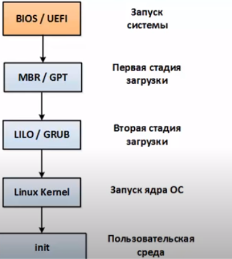
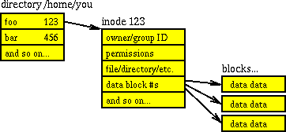

## Linux junior

1. Как выглядит общая структура операционной системы?

    <details>
      <summary>Ответ</summary>
    
    Операционную систему можно условно разделить на слои программного обеспечения. Например, ОС Linux состоит из следующих слоёв:

    * Ядро - центральная часть операционной системы, обеспечивающая приложениям координированный доступ к ресурсам компьютера, таким как процессорное время, память, внешнее аппаратное обеспечение, внешнее устройство ввода и вывода информации. Также обычно ядро предоставляет сервисы файловой системы и сетевых протоколов. В случае ОС Linux ядро состоит из отдельных модулей, реализующих те или иные функции.
    * Оболочка ядра - программа, предоставляющая интерфейс для взаимодействия пользователя с функциями системы. В общем случае различают оболочки с двумя типами интерфейса для взаимодействия с пользователем: текстовый пользовательский интерфейс (TUI) и графический пользовательский интерфейс (GUI). Примеры оболочек - bash, sh, zsh.
    * Приложения - прикладное ПО, запускаемое через оболочку ядра. Это могут быть программы, утилиты, скрипты.

    

    </details>

---

2. Для чего нужна операционная система?

    <details>
      <summary>Ответ</summary>

    Операционные системы необходимы для управления аппаратным обеспечением, предоставления к нему пользовательского доступа, распределения ресурсов между программами, запускаемыми на аппаратном обеспечении.

    </details>

---

3. Как происходит процесс загрузки ОС Linux с момента нажатия кнопки питания?

    <details>
      <summary>Ответ</summary>

    
    
    1. При отправке сигнала о включении компьютера (нажатие кнопки питания или через сеть) CPU начинает загружать BIOS или UEFI.
    2. BIOS или UEFI выполняет проверки работоспособности компонентов компьютера. Если проверки выполнены успешно, BIOS обращается к указанному в его настройках носителю информации (HDD, SDD) для дальнейшей загрузки. Если какая-то проверка выполнилась с ошибкой, BIOS останавливает загрузку и выводит код ошибки.
    3. На носителе информации находится разел MBR (Master Boot Record - главная загрузочная запись) в случае BIOS или GPT (Globally Unique Identifier Partition Table - таблица разделов с уникальным идентификатором) в случае UEFI. Объём этого раздела 446 байт. Из него считывается команда на запуск загрузчика системы.
    4. Если на компьютере установлена одна ОС, то загрузчик запускает Initial RAM Disk - временная файловая система в RAM с файлами, необходимыми для запуска ядра. Если установлено несколько ОС, то загрузчик позволяет выбрать, для какой из ОС запустить Initial RAM Disk.
    5. Ядро операционной системы выполняет инициализацию устройств, запуск драйверов, пользовательской среды и процесса init, от которого форкаются все остальные профессы.

    Подробная статья о процессе загрузки ОС:
    [https://vc.ru/dev/137548-pusk-v-detalyah-kak-zagruzhaetsya-server](https://vc.ru/dev/137548-pusk-v-detalyah-kak-zagruzhaetsya-server)

    </details>

---

4. Что такое файл в терминах Unix-like операционных систем?

    <details>
      <summary>Ответ</summary>

    Файл - объект, в котором хранится информация. Типы файлов в Linux:

    * Обычные файлы - для хранения информации
    * Специальные файлы - для устройств, туннелей, сокетов
    * Директории - файлы, в которых хранятся другие файлы

    </details>

---

5. Что такое файловая система? Какие типы файловых систем существуют?

    <details>
      <summary>Ответ</summary>

    Файловая система - метод организации, хранения и именования данных на электронных носителях информации. Файловая система определяет формат содержимого и способ физического хранения информации, которую принято группировать в виде файлов. Конкретная файловая система определяет размер имен файлов (и каталогов), максимальный возможный размер файла и раздела, набор атрибутов файла. Некоторые файловые системы предоставляют сервисные возможности, например, разграничение доступа или шифрование файлов.
    Типы файловых систем:

    * Файловая система с произвольным доступом. Поскольку доступ к дискам в несколько раз медленнее, чем доступ к оперативной памяти, для прироста производительности во многих файловых системах применяется асинхронная запись изменений на диск. Для этого применяется либо журналирование, например, в ext3, ext4, NTFS, либо механизм soft updates, например, в BSD.
    * Файловая система с последовательным доступом. Используется для ленточных накопителей данных.
    * Файловая система для оптических носителей. Например, ISO9660, HFS, UDF.
    * Виртуальная файловая система. Например, AEFS.
    * Сетевая файловая система. Например, NFS, CIFS, SSHFS.
    * Файловая система для флэш-памяти. Например, exFAT.

    </details>

---

6. Как выглядит иерархия каталогов в Linux (UNIX-like) системах?

    <details>
      <summary>Ответ</summary>
    Структура каталогов в UNIX-like операционных системах регламентируется File Hierarchy Standard (FHS):
    
    | Каталог | Описание |
    | - | - |
    | ```/``` | Корневой каталог, содержащий всю файловую иерархию |
    | ```/bin``` | Основные утилиты, необходимые при работе (например: cat, ls, cp). Содержит в себе бинарные файлы |
    | ```/boot``` | Загрузочные файлы (файлы загрузчика, ядро, initrd, System.map). Часто выносится на отдельный раздел |
    | ```/dev``` | Файлы устройств (например, /dev/null, /dev/zero) |
    | ```/etc``` | Общесистемные конфигурационные файлы |
    | ```/etc/opt``` | Файлы конфигурации для ```/opt``` |
    | ```/etc/security``` | Файлы конфигурации, отвечающие за безопасность системы |
    | ```/home``` | Домашние каталоги пользователей |
    | ```/lib``` | Библиотеки, необходимые для работы программ из /bin и /sbin |
    | ```/media``` | Точки монтирования для сменных носителей, таких как CD-ROM, DVD-ROM |
    | ```/mnt``` | Содержит временно монтируемые файловые системы. Например, флэш-диски и карты памяти |
    | ```/opt``` | Дополнительное программное обеспечение |
    | ```/proc``` | Виртуальная файловая система, представляющая состояние ядра операционной системы и запущенных процессов в виде файлов |
    | ```/root``` | Домашний каталог пользователя root |
    | ```/run``` | Информация о системе с момента её загрузки, в том числе данные, необходимые для работы демонов (pid-файлы, UNIX-сокеты и т. д.) |
    | ```/sbin``` | Основные системные программы для администрирования и настройки системы, например, init, iptables, ifconfig |
    | ```/srv``` | Данные для сервисов, предоставляемых системой (например, www или ftp) |
    | ```/sys``` | Содержит информацию об устройствах, драйверах, а также некоторых свойствах ядра |
    | ```/tmp``` | Временные файлы |
    | ```/usr``` | Вторичная иерархия для данных пользователя. Содержит большинство пользовательских приложений и утилит, используемых в многопользовательском режиме. Может быть смонтирована по сети только для чтения и быть общей для нескольких машин |
    | ```/usr/bin``` | Дополнительные программы для всех пользователей, не являющиеся необходимыми в однопользовательском режиме |
    | ```/usr/include``` | Стандартные заголовочные файлы |
    | ```/usr/lib``` | Библиотеки для программ, находящихся в ```/usr/bin``` и ```/usr/sbin``` |
    | ```/usr/local``` | Третичная иерархия для данных, специфичных для данного хоста. Обычно содержит такие подкаталоги, как ```bin```, ```lib```, ```share``` |
    | ```/usr/sbin``` | Дополнительные системные программы, например демоны сетевых сервисов |
    | ```/usr/share``` | Архитектурно-независимые общие данные |
    | ```/usr/src``` | Исходные коды (например, здесь располагаются исходные коды ядра) |
    | ```/var``` | Изменяемые файлы, такие как лог-файлы, временные почтовые файлы |
    | ```/var/cache``` |  Кэш приложений. Такие данные генерируются локально в результате ресурсозатратных вычислений или операций ввода-вывода. Могут быть удалены без проблем с работой приложений |
    | ```/var/lib``` | Информация о состоянии. Постоянные данные, изменяемые программами в процессе работы. Например, базы данных, метаданные пакетного менеджера |
    | ```/var/lib/mysql``` | Каталог mysql, который используется для хранения файлов базы данных |
    | ```/var/lock``` | Файлы блокировки, указывающие на занятость некоторого ресурса |
    | ```/var/log``` | Файлы логов |
    | ```/var/log/nginx``` | Файлы логов nginx |
    | ```/var/mail``` | Почтовые ящики пользователей |
    | ```/var/run``` | Каталог для хранения информации о системе с момента её загрузки, на данный момент устарел. Допускается делать его симлинком на ```/run```. Каталог оставлен для обратной совместимости с программами, которые всё ещё используют ```/var/run``` |
    | ```/var/spool``` | Задачи, ожидающие обработки, например, очереди печати, непрочитанные или неотправленные письма |
    | ```/var/spool/mail``` | Местоположение пользовательских почтовых ящиков (устаревшее) |
    | ```/var/tmp``` | Временные файлы, которые должны быть сохранены между перезагрузками |

    </details>

---

7. Что такое Inode? Какая информация там хранится?

    <details>
      <summary>Ответ</summary>

    Inode (индексный дескриптор) - структура данных, в которой хранятся метаданные файла и перечислены блоки с данными файла. Хранит всю информацию, кроме имени файла и данных. Каждый файл в каталоге является записью с именем файла и номером индекса. Вся остальная информация о файле извлекается из таблицы индексов путем ссылки на номер индекса. Номера Inode уникальны на уровне раздела. Каждый раздел представляет собой собственную таблицу индексов. Если в разделе диска закончились Inode, то создание новых файлов становится невозможным, даже если в разделе есть свободное место.

    Метаданные, которые хранятся в Inode:
    * Размер
    * Разрешение
    * Владелец/группа
    * Расположение жесткого диска
    * Дата/время
    * Любая другая необходимая информация

    </details>

---

8. Как посмотреть содержимое Inode? Как посмотреть время последней модификации файла?

    <details>
      <summary>Ответ</summary>

    Посмотреть полную информацию, которая содержится в Inode можно при помощи команды ```stat <path_to_file>```.
    Время модификации:

    ```bash
    stat --format=%y dira
    ```

    </details>

---

9. Где хранятся имена файлов и директорий?

    <details>
      <summary>Ответ</summary>

     * Inodes не содержат имён файлов, только метаданные файла
     * Каталоги Unix представляют собой списки ассоциативных структур, каждая из которых содержит одно имя файла и один номер индекса
     * Драйвер файловой системы должен найти каталог, ищущий определенное имя файла, а затем преобразовать имя файла в правильный соответствующий номер индекса

    Таким образом, имя файла/директории хранится в информационной структуре каталогов

    

    </details>

---

10. Что такое точка монтирования?

    <details>
      <summary>Ответ</summary>

    Точка монтирования это каталог или файл, с помощью которого обеспечивается доступ к файловой системе блочного устройства. Используется для динамического подключения и отключения блочных устройств

    </details>

---

11. В каком файле находится информация о файловых системах и устройствах хранения информации?

    <details>
      <summary>Ответ</summary>

    Файл ```/etc/fstab``` содержит информацию о файловых системах, точках монтирования, типах и атрибутах файловых систем

    </details>

---

12. Что такое Hard link? В чем разница между Hard link и Sym link? Примеры их практического применения.

    <details>
      <summary>Ответ</summary>

    Hard link (жёсткая ссылка) - ссылка на файл в файловой системе с использованием Inode этого файла.
    Создадим файл *realFile*:

    ```bash
    touch realFile
    ```

    Создадим жёсткую ссылку командой `ln <целевой_файл> <файл_ссылка>`:

    ```bash
    ln realFile hardLink
    ```
    
    Проверим, что Inode у файла *realFile* и жёсткой ссылки *hardLink* имеют одинаковый идентификатор:
    
    ```bash
    $ ls -li
    итого 0
    2359720 -rw-r--r-- 2 rmntrvn rmntrvn 0 апр 25 23:24 hardLink
    2359720 -rw-r--r-- 2 rmntrvn rmntrvn 0 апр 25 23:24 realFile
    ```

    realFile и hardLink имеют одинаковый идентификатор Inode.

    Sym link (символьная ссылка) - ссылка на файл в файловой системе с использованием другого Inode. Содержит в себе путь к файлу.
    Создадим символьную ссылку командой `ln -s <целевой_файл> <файл_ссылка>`:

    ```bash
    ln -s realFile softLink
    ```

    Проверим, что чистовой идентификатор Inode символьной ссылки *softLink* отличается от числового идентификатора Inode *realFile*.

    ```bash
    $ ls -li
    итого 0
    2359720 -rw-r--r-- 2 rmntrvn rmntrvn 0 апр 25 23:24 hardLink
    2359720 -rw-r--r-- 2 rmntrvn rmntrvn 0 апр 25 23:24 realFile
    2366763 lrwxrwxrwx 1 rmntrvn rmntrvn 8 апр 25 23:29 softLink -> realFile
    ```

    Особенности:

    * Символьные ссылки используют другие номера Inode, нежели основные файлы.
    * Символьные ссылки могут вести на каталоги.
    * Символьные ссылки могут вести на объекты, расположенные на других логических разделах.
    * Жёсткие ссылки могут размещаться только на том же логическом разделе, что и оригинальный файл. Это связано с тем, что на каждом диске присутствует свой раздел с Inode.
    * Жёсткие ссылки могут быть созданы только для файлов. Для папок их создание невозможно.

    </details>

---

13. Как работают права доступа к файлу?

    <details>
      <summary>Ответ</summary>
    
    В Linux у каждого файла есть три параметра доступа:

    * Read (r) - разрешает получить содержимое файла, но не разрешает записать в файл. Для каталога позволяет получить список файлов и каталогов, расположенных в нем
    * Write (w) - разрешает записывать новые данные в файл или изменять существующие, а также позволяет создавать и изменять файлы и каталоги
    * Execute (x) - разрешать выполнить файл или программу. Без этого флага невозможно выполнить бинарные файлы и shell-скрипты

    При этом, каждый файл имеет три категории пользователей, для которых можно устанавливать различные сочетания прав доступа:

    * User - набор прав для пользователя, который создал файл или сейчас назначен его владельцем. Обычно для владельца доступны все действия с файлом (rwx)
    * Group - любая группа пользователей, существующая в системе и привязанная к файлу. К файлу может быть привязана только одна группа и обычно это группа владельца, хотя для файла можно назначить и другую группу
    * Other - все пользователи, кроме владельца файла и пользователей, входящих в группу файла

    С помощью этих наборов полномочий и устанавливаются права доступа к файлам в Linux. Помимо наборов прав, указанных выше, существуют особые права доступа, SUID и SGID биты, а также липкий бит:

    * SUID - если он установлен, то при выполнении программы, id пользователя, от которого она запущена заменяется на id владельца файла. Фактически, это позволяет обычным пользователям запускать программы от имени суперпользователя
    * SGID - этот флаг работает аналогичным SUID образом, только пользователь считается членом группы, с которой связан файл, а не групп, к которым он действительно принадлежит. Если SGID флаг установлен на каталог, все файлы, созданные в нем, будут связаны с группой каталога, а не пользователя. Такое поведение используется для организации общих папок
    * Липкий бит - этот бит тоже используется для создания общих папок. Если он установлен, то пользователи могут только создавать, читать и выполнять файлы, но не могут удалять файлы, принадлежащие другим пользователям

    Посмотреть список файлов в директории вместе с их правами можно при помощи команды ```ls -la```:

    ```bash
    drwxr-xr-x 5 user group  4096 Aug 29 11:34 directoryname # директория с полными правами у пользователя user
    -rwxr-xr-x 5 user group  4096 Aug 29 11:35 filename1 # файл с полными правами у пользователя user
    -rwsr-xr-x 5 user group  4096 Aug 29 11:36 filename2 # файл, у которого установлен SUID-бит (буква s в наборе rwx-битов, отвечающих за права пользователя)
    -rwxr-sr-x 5 user group  4096 Aug 29 11:36 filename3 # файл, у которого установлен SGID-бит (буква s в наборе rwx-битов, отвечающих за права группы)
    -rwxr-sr-t 5 user group  4096 Aug 29 11:36 filename3 # файл, у которого установлен липкий бит (буква t в наборе rwx-битов, отвечающих за права всех остальных)
    ```

    За права файлов тут отвечают черточки. Первая это тип файла, который рассмотрен в отдельной статье. Дальше идут группы прав для владельца, для группы и для всех остальных. Всего девять черточек на права и одна на тип. Права доступа записываются в Inode в виде битов. Каждую группу прав представляют в виде десятичного числа. Полная таблица преобразования выглядит так:

    | Read | Write | Execute | Десятичное число |
    | - | - | - | - |
    | 1 | 1 | 1 | **7** |
    | 1 | 1 | 0 | **6** |
    | 1 | 0 | 1 | **5** |
    | 1 | 0 | 0 | **4** |
    | 0 | 1 | 1 | **3** |
    | 0 | 1 | 0 | **2** |
    | 0 | 0 | 1 | **1** |
    | 0 | 0 | 0 | **0** |

    Например, права доступа ```rw-rw----``` можно записать как 660, права ```rwxr-x--x``` как 751, права ```rwxrwxrwx``` как 777. Изменить права доступа файла можно при помощи утилиты chmod для файла:

    ```bash
    chmod 755 /home/user/filename
    ```

    и для папки

    ```bash
    chmod -R 777 /tmp/temporary_folder 
    ```

    </details>

---

14. Зачем директории права исполнения (+x)?

    <details>
      <summary>Ответ</summary>

    Права исполнения позволяют перемещаться в директорию и обращаться ко всем расположенным в ней файлам и каталогам. Обращаться можно при условии, что файлы в директории доступны на чтение, или запись, или выполнение. Если убрать с директории права исполнения, то в неё будет невозможно перейти.

    </details>

---

15. Какую команду необходимо выполнить, чтобы посмотреть список пользователей, вошедших в систему?

    <details>
      <summary>Ответ</summary>

    Команда ```w``` отображает список пользователей, вошедших на сервер

    </details>

---

16. Какой файл необходимо отредактировать, чтобы отключить ssh аутентификацию по паролю?

    <details>
      <summary>Ответ</summary>

    Необходимо отредактировать файл ```/etc/ssh/sshd_config```, отвечающий за конфигурацию сервиса ssh

    </details>

---

17. Что такое LA? В каких единицах измеряется?
    <details>
      <summary>Ответ</summary>

    LA (Load Average) - параметр, определяющий среднюю нагрузку на систему за период времени (1 мин, 5 минут, 15 минут). Вычисляется как длина очереди выполнения в операционной системе, где единица означает, что очередь заполнена, а значение выше единицы — что есть процессы, которые ожидают своей очереди на выполнение. Интерпретация значений LA:

    * Если LA за 1, 5, 15 минут равен 0.0, система находится в ожидании
    * Если LA за 1 минуту выше LA за 5 или 15 минут, то нагрузка на систему увеличивается
    * Если LA за 1 минуту ниже LA за 5 или 15 минут, то нагрузка уменьшается
    * Если LA больше, чем количество процессорных ядер на сервере, то это свидетельствует о проблемах с производительностью

    </details>

---

18. Что будет если на сервере LA = 100? 

    <details>
      <summary>Ответ</summary>

    Зависит от количества ядер в системе. Если количество ядер равно 100, то данное значение свидетельствует о полной загрузке очереди выполнения. Если количество ядер меньше 100, то данное значение свидетельствует о перегрузке. Если количество ядер больше 100, то данное значение означает о наличии свободных ресурсов.

    </details>

---

19. Почему при высоких показателях значения LA на сервере может не наблюдаться проблем (консоль ssh отзывается, сервисы работают в обычном режиме)?

    <details>
      <summary>Ответ</summary>

    На параметр нагрузки LA влияет также и ожидание ввода-вывода (параметр *wa* в утилите *top*) дисков, и задержка сети. Данные параметры могут не влиять на работу основных сервисов в системе, но учитываются при расчете общей нагрузки на систему. 

    </details>

---

20. Что такое процесс? Что такое поток? В чём отличие между процессом и потоком?

    <details>
      <summary>Ответ</summary>

    Процесс — экземпляр программы во время выполнения, независимый объект, которому выделены системные ресурсы (например, процессорное время и память). Каждый процесс выполняется в отдельном адресном пространстве: один процесс не может получить доступ к переменным и структурам данных другого. Поток (thread) - сущность операционной системы, процесс выполнения на процессоре программного кода. Общее назначение потоков — параллельное выполнение на процессоре двух или более различных задач. Каждый процесс имеет как минимум один поток.

    </details>

---

21. Какие состояния процессов существуют? Что значит состояние процесса D?

    <details>
      <summary>Ответ</summary>

    | **Статус** | **Описание** |
    | - | - |
    | R (Running or runnable) | Процесс выполняется в данный момент |
    | S (Interruptible sleep) | Неактивен (спит менее 20 сек) |
    | D (Uninterruptible sleep) | Ожидает записи на диск |
    | T (Stopped by job control signal) | Остановлен или трассируется отладчиком |
    | Z (Zombie) | Процесс-зомби |
    | W (Paging (Not valid since the 2.6.xx Kernel)) | Процесс выгружен на своп-раздел диска |
    | < | Процесс имеет повышенный приоритет nice |
    | N | Процесс имеет пониженный приоритет nice |
    | L (locked) | Некоторые страницы блокированы в памяти |
    | s | Процесс является лидером сеанса |

    </details>

---

22. Что такое системный вызов, какие они бывают?

    <details>
      <summary>Ответ</summary>

    Системный вызов - обращение программы к ядру операционной системы для выполнения какой-либо операции.

    В Unix, Unix-like и других POSIX-совместимых операционных системах популярными системными вызовами являются:

    * open
    * read
    * write
    * close
    * wait
    * exec 
    * fork
    * exit
    * kill

    </details>

---

23. Что такое сигналы в Unix? Зачем они нужны?

    <details>
      <summary>Ответ</summary>

    Сигнал в Unix-like операционных системах - асинхронное (происходящее в случайное время) уведомление процесса о каком-либо событии, один из основных способов взаимодействия между процессами. Когда сигнал послан процессу, операционная система прерывает выполнение процесса, при этом, если процесс установил собственный обработчик сигнала, операционная система запускает этот обработчик, передав ему информацию о сигнале, если процесс не установил обработчика, то выполняется обработчик по умолчанию.

    Отправка сигналов от одного процесса к другому обычно осуществляется при помощи системного вызова *kill*. Его первый параметр – PID процесса, которому отправляется сигнал, второй параметр – номер сигнала.

    ```bash
    kill(1111, SIGTERM);
    ```

    При вызове из командной строки можно пользоваться форматом ```kill -signalNumber PID```. Например, для отправки сигнала безусловного завершения процессу с PID 12345 нужно выполнить команду

    ```bash
    kill -9 12345
    ```

    Стандарт POSIX определяет 28 сигналов, жирным выделены сигналы, с которыми пользователь сталкивается чаще всего:

    | Название | Номер | Действие по умолчанию | Описание | Тип |
    |-|-|-|-|-|
    | **SIGHUP** | **1** | **Завершение** | **Закрытие терминала** | **Уведомление** |
    | **SIGINT** | **2** | **Завершение** | **Сигнал прерывания выполнения (Ctrl + C) с терминала** | **Управление** |
    | SIGQUIT | 3 | Завершение с дампом памяти | Сигнал "Quit" (Ctrl + \\) с терминала | Управление |
    | SIGILL | 4 | Завершение с дампом памяти | Недопустимая инструкция процессора | Исключение |
    | SIGTRAP | 5 | Завершение с дампом памяти |  Ловушка трассировки или брейкпоинт | Отладка |
    | SIGABRT | 6 | Завершение с дампом памяти | Сигнал, посылаемый функцией abort() | Управление |
    | SIGFPE | 8 | Завершение с дампом памяти | Ошибочная арифметическая операция | Исключение |
    | **SIGKILL** | **9** | **Завершение** | **Безусловное завершение** | **Управление** |
    | SIGBUS | 10 | Завершение с дампом памяти | Неправильное обращение в физическую память | Исключение |
    | SIGSEGV | 11 | Завершение с дампом памяти | Нарушение при обращении в память | Исключение |
    | SIGSYS | 12 | Завершение с дампом памяти | Неправильный системный вызов | Исключение |
    | SIGPIPE | 13 | Завершение | Запись в разорванное соединение (пайп, сокет) | Уведомление |
    | SIGALRM | 14 | Завершение | Сигнал истечения времени, заданного alarm() | Уведомление |
    | **SIGTERM** | **15** | **Завершение** | **Сигнал завершения (сигнал по умолчанию для утилиты kill)** | **Управление** |
    | SIGUSR1 | 16 | Завершение | Пользовательский сигнал №1 | Пользовательский |
    | SIGUSR2 | 17 | Завершение | Пользовательский сигнал №2 | Пользовательский |
    | SIGCHLD | 18 | Игнорируется | Дочерний процесс завершен или остановлен | Уведомление |
    | **SIGTSTP** | **20** | **Остановка процесса** | **Сигнал остановки (Ctrl + Z) с терминала** | **Управление** |
    | SIGURG | 21 | Игнорируется | На сокете получены срочные данные | Уведомление |
    | SIGPOLL | 22 | Завершение | Событие, отслеживаемое poll() | Уведомление |
    | **SIGSTOP** | **23** | **Остановка процесса** | **Остановка выполнения процесса** | **Управление** |
    | **SIGCONT** | **25** | **Продолжить выполнение** | **Продолжить выполнение ранее остановленного процесса** | **Управление** |
    | SIGTTIN | 26 | Остановка процесса | Попытка чтения с терминала фоновым процессом | Управление |
    | SIGTTOU | 27 | Остановка процесса | Попытка записи на терминал фоновым процессом | Управление |
    | SIGVTALRM | 28 | Завершение | Истечение «виртуального таймера» | Уведомление |
    | SIGPROF | 29 | Завершение | Истечение таймера профилирования | Отладка |
    | SIGXCPU | 30 | Завершение с дампом памяти | Процесс превысил лимит процессорного времени | Исключение |
    | SIGXCPU | 31 | Завершение с дампом памяти | Процесс превысил допустимый размер файла | Исключение |

    </details>

---

24. В чём отличие между сигналами 9, 15 и 23?

    <details>
      <summary>Ответ</summary>

    Сигнал 9 это немедленное и безусловное завершение процесса. Сигнал 15 это штатная остановка процесса, подразумевающая плановое завершение всех операций, связанных с этим процессом. Сигнал 23 это постановка выполнения процесса на паузу. Возобновить работу процесса, поставленного на паузу, можно при помощи сигнала 25.

    </details>

---

25. Что такое Exit-code или код завершения?

    <details>
      <summary>Ответ</summary>

    Exit-code или код завершения это целое число в диапазоне от 0 до 255, которое возвращает программа или скрипт после выполнения. Этот число обозначает результат выполнения. Также exit-код является аргументом bash-команды exit, например ```exit 130```. Посмотреть значение кода завершения последней исполненной команды в bash можно при помощи ```echo $?```. При помощи кодов завершения можно добавлять логику выполнения команд в bash-скрипты, например обработку кодов, свитетельствующих об ошибках. В bash существуют зарезервированные коды завершения:

    | Код | Описание |
    | - | - |
    | 0 | Успешное выполнение команды |
    | 1 | Ошибка выполнения команды |
    | 2 | Пропущен аргумент или ключевое слово команды |
    | 126 | Вызванная команда не может быть исполнена |
    | 127 | Указанная команда не найдена |
    | 128 | Неверный аргумент команды exit, например ```exit 3.14159``` |
    | 128 + n | Фатальная ошибка с сигналом n. Например, команда kill -9 PID вернёт код возврата 137 |
    | 130 | Завершение команды по Ctrl + C, то есть по сигналу 2 (130 = 128 + 2) |
    | 255 | Аргумент команды exit вне диапазона от 0 до 255, например ```exit -1``` |

    Более подробный список кодов завершения можно увидеть тут:

    <https://www.cyberciti.biz/faq/linux-bash-exit-status-set-exit-statusin-bash/>

    </details>

---

26. Что такое процесс-зомби и процесс-сирота?

    <details>
      <summary>Ответ</summary>

    Процесс-зомби - дочерний процесс в Unix-системе, который завершил своё выполнение, но код завершения которого ещё не был считан родительским процессом. Процессы-зомби присутствуют в списке процессов операционной системы и обозначаются буквой Z. Удаление процесса-зомби возлагается на родительский процесс или на системный вызов `wait()`. Если родительский процесс не удалит своих потомков, то они останутся в состоянии зомби. Процессы-зомби не потребляют ресурсы, однако занимают записи в таблице процессов, что при наличии большого количества процссов-зомби может привести к невозможности создания новых процессов. Завершить процесс-зомби напрямую невозможно. Чтобы убить процесс-зомби, нужно найти родительский процесс и завершить его. Найти процессы-зомби и их родителей можно следующей командой:
    
    ```bash
    ps ajx | grep -w Z
    ```
    
    PID'ы процессов родителей в 3 колонке. Убить процесс можно следующей командой:
    
    ```bash
    kill -9 <PID процесса родителя>
    ```

    Процесс-сирота - вспомогательный процесс в Unix-системе, чей процесс-родитель был завершен нештатно, то есть не подав сигнал на завершение работы. Отличие между процессом-зомби и процессом-сиротой в том, что процесс-сирота является активным, то есть выполняется, а процесс-зомби завершил своё выполнение. После нештатного прерывания родительского процесса, процесс-сирота переходит под управление init, процесса инициализации с PID 1. Процесс-сирота может быть создан пользователем при отсоединении выполняемого процесса от терминала. В отличие от процессов-зомби, процессы-сироты могут быть найдены и остановлены по отдельности. Делается это следующим образом:

    Вывести список процессов в виде дерева:

    ```bash
    ps afux
    ```

    Найти в списке процессы-сироты с родительским процессом init и завершить их при помощи команды ```kill -9 <PID процесса-сироты>```

    </details>

---

27. Представлен вывод команды *top*. Что означает каждая запись в выводе?

     ```bash
     top - 21:29:24 up 14:18,  1 user,  load average: 0,78, 1,48,   1,10
     Tasks: 277 total,   3 running, 274 sleeping,   0 stopped,      0 zombie
     %Cpu(s): 12,4 us,  2,5 sy,  0,1 ni, 84,8 id,  0,1 wa,  0,0   hi,  0,1 si,  0,0 st
     KiB Mem :  7106404 total,   306972 free,  3127144 used,    3672288 buff/cache
     KiB Swap:  8191996 total,  8191996 free,        0 used.    3270520 avail Mem 
     ```

    <details>
      <summary>Ответ</summary>

    *top* - название утилиты.

    *21:29:24* - текущее время системы.

    *up 14:18* - сколько часов:минут система работает с момента последнего запуска.

    *1 user* - количество пользователей, авторизованных в системе.

    *load average: 0,78, 1,48, 1,10* - параметр средней нагрузки на систему за период времени 1 минута, 5 минут, 15 минут.

    *277 total* - всего процессов в системе.

    *3 running* - количество запущенных процессов.

    *274 sleeping* - количество процессов в состоянии sleeping. Они ожидают какого-либо события или сигнала.

    *0 stopped* - количество процессов, приостановленных сигналом STOP или выполнением трассировки.

    *0 zombie* - количество зомби-процессов, которые завершили своё выполнение, но присутствуют в системе чтобы дать родительскому процессу считать свой код завершения.

    | Параметр | Описание |
    | - | - |
    | us (user) | Использование процессора пользовательским процессами |
    | sy (system) | Использование процессора системным процессами |
    | ni (nice) | Использование процессора процессами, чей приоритет был изменён командой nice |
    | id (idle) | Простой процессора. Можно сказать, что это свободные ресурсы |
    | wa (IO-wait) | Говорит о простое, связанным с вводом/выводом |
    | hi (hardware interrupts) | Показывает, сколько процессорного времени было потрачено на обслуживание аппаратного прерывания |
    | si (software interrupts) | Показывает, сколько процессорного времени было потрачено на обслуживание программного прерывания |
    | st (stolen by the hypervisor) | Показывает, сколько процессорного времени было «украдено» гипервизором |

    KiB Mem - количество оперативной памяти в кибибайтах (кратно 1024):
    *7106404 total* -- всего доступно оперативной памяти в системе,
    *306972 free* -- свободно оперативной памяти для использования,
    *3127144 used* -- использовано оперативной памяти,
    *3672288 buff/cache* -- буферизовано/закешировано оперативной памяти.

    *KiB Swap* - количество swap-памяти в кибибайтах (кратно 1024), которая выделена на диске:
    *8191996 total* - всего выделено swap-памяти,
    *8191996 free* - свободно swap-памяти
    *0 used* - использовано swap-памяти,
    *3270520 avail Mem* - доступно для использования swap-памяти.

    </details>

---

28. Как в утилите top в Linux посмотреть нагрузку на каждое ядро процессора?

    <details>
      <summary>Ответ</summary>

    Чтобы отобразить все ядра в системе, нужно нажать `1`.

    </details>

---

29. Как в утилите top в Linux посмотреть, какой командой был запущен процесс?

    <details>
      <summary>Ответ</summary>

    Чтобы отобразить команды, которыми были запущены процессы, нужно нажать `c`.

    </details>

---

30. Что такое Kernel Panic?

    <details>
      <summary>Ответ</summary>

    Критическая ошибка ядра Linux, после которой система не может продолжать работу.

    </details>

---

31. С помощью чего можно собрать информацию о текущем состоянии процессора, памяти, диска, сети?

    <details>
      <summary>Ответ</summary>

    * top - консольная команда, которая выводит список работающих в системе процессов и информацию о них. По умолчанию она в реальном времени сортирует их по нагрузке на процессор
    * htop - усовершенствованная версия top
    * atop - интерактивный монитор производительности. Является аналогом top, но в отличие от него выводит только новые изменения об активных системных процессах. Важной особенностью является возможность сохранения данных в файл собственного двоичного формата. В debian-подобных операционных системах, процесс atop запускается сразу после установки и постоянно записывает информацию в ```/var/log/atop.log```
    * iotop - мониторинг ввода\вывода
    * iftop - мониторинг сетевого интерфейса
    * iptraf - мониторинг трафика
    * nmon - универсальная утилита для мониторинга
    * sysstat - набор утилит с информацией о системе

    </details>

---

32. Как посмотреть нагрузку на диски?

    <details>
      <summary>Ответ</summary>

    При помощи набора утилит ```sysstat```. Проверить нагрузку на диски можно командой ```iostat -xtc```

    </details>

---

33. Что такое swappiness?

    <details>
      <summary>Ответ</summary>

    Параметр vm.swappiness задаёт процент свободной оперативной памяти, при котором начинает использоваться раздел подкачки. По умолчанию vm.swappiness равен 60. То есть, если осталось менее 40% свободной оперативной памяти, то начинает использоваться swap раздел. Очевидно, что для современных компьютеров с 8-16 гигабайтами ОЗУ это неприемлемо. Поэтому лучше выставить vm.swappiness равным 5-10. Для того, чтобы изменить vm.swappiness, необходимо открыть файл ```/etc/sysctl.conf``` от лица суперпользователя и дописать в самый конец:

    ```bash
    vm.swappiness=5
    ```

    Затем нужно сохранить файл и перезагрузить систему. После перезагрузки можно проверить значение vm.swappiness при помощи команды:

    ```bash
    cat /proc/sys/vm/swappiness
    ```

    Должно вернуться значение 5.

    </details>

---

34. Что такое OOM Killer?

    <details>
      <summary>Ответ</summary>

    Linux Out-Of-Memory Killer это компонент ядра, позволяющий решить проблему недостатка памяти путём завершения наименее приоритетных процессов. Каждый процесс в системе имеет оценку oom_score, которую присваивает функция oom_badness. oom_score хранится в файле /proc/PID/oom_score. Чем выше oom_score, тем выше вероятность завершения процесса. Параметр oom_score наследуется процессами-потомками. Также у каждого процесса имеется параметр oom_adj (/proc/PID/oom_adj), который позволяет регулировать значение oom_score. Если необходимо защитить процесс от завершения при помощи OOM-Killer, нужно присвоить значение oom_adj равное -17. В этом случае процесс не будет завершён даже если он полностью займёт оперативную память. Однако, такое поведение приведёт к Kernel Panic.

    </details>

---

35. Как посмотреть свободное место на диске?

    <details>
      <summary>Ответ</summary>

      При помощи команды ```df -h```

      Более подробно использование команды df описано здесь:

      <https://www.geeksforgeeks.org/df-command-linux-examples/>

    </details>

---

36. Что произойдет при выполнении команд:

    ```cat file1 > file2```

    ```cat file1 >> file2```

    <details>
      <summary>Ответ</summary>

    Оператор ```>``` перезаписывает существующий файл или создает файл, если файл с указанным именем отсутствует в каталоге
    Оператор ```>>``` добавляет данные в существующий файл или создает файл, если файл с указанным именем отсутствует в каталоге

    Соответственно, при выполнении команд ```cat file1 > file2``` и ```cat file1 >> file2```, содержимое file1 будет записано два раза в file2

    </details>

---

37. Как удалить содержимое файла, при этом оставив файл как таковой, не меняя его имя и права доступа?

    <details>
      <summary>Ответ</summary>

    При помощи команды ```:> filename```. На админском жаргоне эта команда называется "дятел"

    </details>

---

38. В чем разница между ```Ctrl + C``` и ```Ctrl + Z```?

    <details>
      <summary>Ответ</summary>

    Команда ```Ctrl + C``` прерывает выполнение процесса, а команда ```Ctrl + Z``` ставит выполнение процесса на паузу, возвращая терминал пользователю. Возобновить работу процесса можно при помощи команд ```bg``` (возобновить в фоне) или ```fg``` (возобновить в терминале)

    </details>

---

39. Как запустить команду в фоновом режиме, чтобы она выполнялась после выхода пользователя из системы?

    <details>
      <summary>Ответ</summary>

    При помощи ```nohup COMMANDNAME &```. После ввода команды нужно два раза нажать Enter, чтобы в терминале отобразился PID. В дальнейшем, следить за работой команды можно по этому PID при помощи ```PS aux```

    </details>

---

40. Как удалить файл с именем ```-rf```?

    <details>
      <summary>Ответ</summary>

    ```bash
    rm ./-rf
    ```

    </details>

---

41. Для чего нужна переменная окружения PATH?

    <details>
      <summary>Ответ</summary>

    Переменная окружения PATH содержит абсолютные пути директорий, в которых производится поиск исполняемых файлов при вводе команд

    </details>
---

42. В чем разница между объявлением переменной `export VAR="VALUE"` и `VAR="VALUE"` в bash?

    <details>
      <summary>Ответ</summary>

    При объявлении переменной через export - переменная будет доступна в любых других процессах, при обычном объявлении переменной - переменная будет доступна только в запущенном процессе.

    </details>

---

43. Как остановить выполнение скрипта в bash при возникновении ошибки в команде?

    <details>
      <summary>Ответ</summary>

    Команда `set -e` завершит скрипт с ошибкой, в случае, если в нижеследующем bash коде будет обнаружена ошибка. По-умолчанию bash скрипт продолжает работу, если в ходе выполнения возникла ошибка.

    </details>

---

44. Что в bash скрипте означает команда `set -euo pipefail`?

    <details>
      <summary>Ответ</summary>

    Команда `set` устанавливает аттрибуты оболочки с опеределенных опций.
    Опция `-e` - означает, что скрипт будет остановлен, когда произойдет ошибка в ходе его выполнения.
    Опция `-u` - означает, что скрипт будет остановлен, если в ходе скрипта, будет обнаружена переменная, которая не определена.
    Опция `-o pipefail` - означает, что скрипт будет остановлен, если в ходе пайплайна команд будет выявлена ошибка. 

    </details>

---

45. Как активировать debug режим в bash?

    <details>
      <summary>Ответ</summary>

    Команда `set -x` в начале скрипта активирует вывод в консоль debug информации.

    </details>

---

46. Что значит `$@` в bash?

    <details>
      <summary>Ответ</summary>

    `$@` - все параметры переданные скрипту.

    </details>

---

47. Как выполнить фильтрацию вывода команды, чтобы на экран были выведены только ошибки (STDERR), игнорируя STDOUT?

    <details>
      <summary>Ответ</summary>

    ```bash
    cmd 2>&1 >/dev/null | grep pattern
    ```

    </details>

---

48. В bash-скрипте указан атрибут оболочки `set -x`. В одной из команд происходит ошибка и скрипт завершает свою работу. Как сделать, чтобы при возникновении ошибки в определенной команде скрипт продолжил свою работу?

    <details>
      <summary>Ответ</summary>

    1 вариант: указать `|| true` после выполнения команды с ошибкой.

    ```bash
    <command with error> || true
    ```

    2 вариант: до выполнения данной команды указать `set +e` для игнорирования ошибок, начиная со следующей строки и после выполнения команды указать `set -e` для завершения работы скрипта в случае ошибки, начиная со следующей строки.

    ```bash
    set -e
    <command 1>
    <command 2>
    set +e
    <command 3 wih error>
    set -e
    ```

    </details>

---

49. Что выведет команда `cat a` и почему?

    ```bash
    mkdir /tmp/abc
    cd /tmp/abc
    ls >a 2>b
    cat a
    ```

    <details>
      <summary>Ответ</summary>

    `cat a` выведет

    ```bash
    a
    b
    ```
    Обработка команды идёт справа налево. Сначала создается файл *b*, потом создается файл *a*, команда `ls` отображает список файлов в текущей директории (файлы *a* и *b* уже созданы) в одну колонну и перенаправляет стандартный поток вывода (`>`) в файл *a*, а стандартный поток ошибок `2` в файл *b*. 

    </details>

---

50. Как перенаправить одновременно stderr и stdin?

    <details>
      <summary>Ответ</summary>

    ```bash
    exec < file 2>&1
    ```

    </details>

---

51. Что делает команда grep?

    <details>
      <summary>Ответ</summary>

    grep - утилита командной строки, которая находит на вводе строки, отвечающие заданному регулярному выражению, и выводит их, если вывод не отменён специальным ключом

    </details>

---

52. Что такое bash-скрипт?

    <details>
      <summary>Ответ</summary>

    Bash-скрипт это исполняемый файл, сценарий командной строки для оболочки bash

    </details>

---

53. Какие типы переменных используются в bash?

    <details>
      <summary>Ответ</summary>

    Типы переменных в bash отсутствуют. Переменная в bash может представлять собой число, символ или строку символов. Имя переменной может начинаться с буквы или с символа подчеркивания и не может содержать дефис. Физически, переменные представляют собой именованные участки памяти, в которые может быть записана какая-либо информация. Необходимо понимать различия между именем переменной и ее значением. Если var1 — это имя переменной, то $var1 — это ссылка на ее значение. Тем не менее, переменные в Bash можно разделить на переменные окружения (текстовые переменные операционной системы, хранящие информацию) и пользовательские переменные (переменные, определённые пользователем в процессе работы). Пользовательская переменная переносится в окружение при помощи команды ```export```

    </details>

---

54. Что выведут команды:

    ```echo hostname```

    ```echo $(hostname)```

    ```echo ${hostname}```

    <details>
      <summary>Ответ</summary>

    ```echo hostname``` просто вернёт слово hostname

    Конструкция $() используется для выполнения команд внутри неё и передачи их в качестве аргумента в исходную команду. Поэтому, ```echo $(hostname)``` вернёт название хоста

    Конструкция ${} используется для вызова переменных, поэтому команда ```echo ${hostname}``` вернёт значение переменной hostname, если она была задана. Если переменная hostname не была задана, то команда вернёт просто строку нулевой длины

    </details>

---

55. Что такое RAID? Какие массивы бывают?

    <details>
      <summary>Ответ</summary>

    RAID (Redundant Array of Independent Disks) - избыточный массив независимых дисков, технология виртуализации данных для объединения нескольких физических дисковых устройств в логический модуль для повышения отказоустойчивости и производительности.

    В зависимости от количества дисков и класса отказоустойчивости существуют следующие основные типы RAID:
    RAID 0:
    RAID 1:
    RAID 5:
    RAID 6:
    RAID 10:

    </details>

---

56. При каком количестве одновременно вышедших из строя дисков обеспечивает работоспособность RAID 6?

    <details>
      <summary>Ответ</summary>

    2 диска

    </details>

---

57. Что такое демон? Как демонизировать приложение?

    <details>
      <summary>Ответ</summary>

    Демон - приложение, запущенное в фоновом режиме и работающее без участия пользователя. Аналог службы в Windows. Чтобы демонизировать приложение, нужно создать юнит systemd

    </details>

---

58. Что такое Steal time?

  <details>
      <summary>Ответ</summary>

    <https://mcs.mail.ru/blog/steal-kto-kradet-u-virtualnykh-mashin-protsessornoe-vremya>

    </details>
