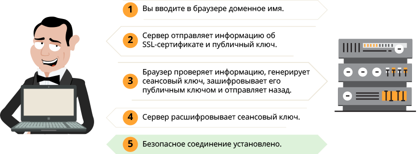
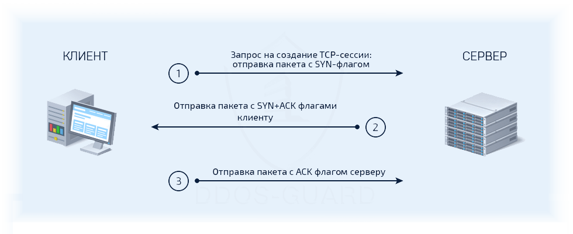

## Сети и передача данных

1. Что такое модель OSI?

    <details>
      <summary>Ответ</summary>

    OSI - сетевая модель набора сетевых протоколов OSI/ISO. Посредством данной модели различные сетевые устройства могут взаимодействовать друг с другом. Модель определяет семь различных уровней (слоёв) взаимодействия систем. Каждый уровень выполняет определённые функции

    | Уровень | Тип данных | Функции | Примеры | Оборудование |
    | - | - | - | - | - |
    | Физический | Биты | Работа со средой передачи, сигналами и двоичными данными | RJ-45, радиоканал | Витая пара, повторитель, концентратор |
    | Канальный | Кадры | Физическая адресация | ARP, Ethernet | Сетевой мост, Коммутатор |
    | Сетевой | Пакеты | Определение маршрута и логическая адресация | IPv4, IPv6, ICMP | Маршрутизатор |
    | Транспортный | Сегменты, датаграмы | Прямая связь между конечными пунктами и надёжность | TCP, UDP | Хосты (клиенты сети), межсетевой экран |
    | Сеансовый | Данные (наборы сегментов или датаграмм) | Управление сеансом связи | L2TP, gRPC | Хосты (клиенты сети), межсетевой экран | 
    | Представления | Данные (наборы сегментов или датаграмм) | Представление и шифрование данных | ASCII, MIME | Хосты (клиенты сети), межсетевой экран | 
    | Прикладной | Данные (наборы сегментов или датаграмм) | Доступ к сетевым службам | HTTP, FTP, POP3, SMTP, WebSocket, DNS | Хосты (клиенты сети), межсетевой экран |

    </details>

---

2. Что такое TCP/IP?

    <details>
      <summary>Ответ</summary>

    TCP/IP - сетевая модель передачи данных, представленных в цифровом виде. Модель описывает способ передачи данных от источника информации к получателю. В отличие от модели OSI, модель TCP/IP объединяет сетевые протоколы в четыере уровня:

    | Модель OSI | Модель TCP/IP |
    | - | - |
    | Физический уровень | Уровень доступа к сети |
    | Канальный уровень | Уровень доступа к сети |
    | Сетевой уровень | Уровень сети интернет |
    | Транспортный уровень | Транспортный уровень |
    | Сеансовый уровень | Уровень приложений |
    | Представления уровень | Уровень приложений |
    | Прикладной уровень | Уровень приложений |

    </details>

---

3. Что такое маска подсети?

    <details>
      <summary>Ответ</summary>

    Маска подсети - битовая маска для определения по IP-адресу адреса подсети и адреса узла (хоста, компьютера, устройства) этой подсети. Благодаря маске можно узнать, какая часть IP-адреса узла сети относится к адресу сети, а какая — к адресу самого узла в этой сети. Также маски используются для определения подсети IP-адресов. С помощью маски подсети можно сказать, что один диапазон IP-адресов будет в одной подсети, а другой диапазон соответственно в другой подсети. Маски записываются или в виде, аналогичном IP-адресам (255.255.255.0), или в виде длины префикса (192.168.0.0/24, здесь /24 является указанием длины префикса в битах)

    </details>

---

4. Из чего состоит IP-пакет?

    <details>
      <summary>Ответ</summary>

    IP-пакеты состоят из заголовка и полезной нагрузки. Заголовок пакета IPv4 состоит из:

    1. 4 бита содержат версию пакета: IPv4 или IPv6
    2. 4 бита содержат длину интернет-заголовка, которая измеряется отрезками по 4 байта (например, 5 означает 20 байт)
    3. 8 бит содержат тип обслуживания, известный также как качество обслуживания (QoS), описывающее приоритеты пакета
    4. 16 бит содержат длину пакета в байтах
    5. 16 бит содержат тег идентификации, помогающий восстановить пакет из нескольких фрагментов
    6. 3 бита содержат нуль, флаг разрешения фрагментации пакета (DF: не фрагментировать), а также флаг разрешения дальнейшей фрагментации (MF: фрагментировать дальше)
    7. 13 бит содержат смещение фрагмента, поле для идентификации положение фрагмента в исходном пакете
    8. 8 бит содержат время жизни (TTL), которое определяет количество переходов (через маршрутизаторы, компьютеры и сетевые устройства), разрешённых сделать пакету, прежде чем он исчезнет (например, пакету с TTL 16 разрешено пройти не более 16 маршрутизаторов, чтобы добраться до места назначения)
    9. 8 бит содержат протокол (TCP, UDP, ICMP и т. д.)
    10. 16 бит содержат контрольную сумму заголовка, используемую при обнаружении ошибок
    11. 32 бит содержат IP-адрес источника
    12. 32 бит содержат адрес места назначения

    После этих данных может быть добавлено разное количество необязательных флагов, меняющихся в зависимости от используемого протокола, затем идут данные, которые переносит пакет. IP-пакет не имеет хвоста. Однако, IP-пакеты часто переносятся как полезная нагрузка внутри фрейма Ethernet, который имеет свой собственный заголовок и хвост

    </details>

---

5. Что такое фрагментация IP-пакета?

    <details>
      <summary>Ответ</summary>

    Фрагментация пакета — генерация нескольких сетевых пакетов из одного. Происходит при превышении длины кадра максимальной единицы передачи (MTU) интерфейса, через который он в данный момент проходит. Фрагментация (и её запрещение) поддерживается IP протоколом и не предусмотрена в большинстве других протоколов. Если сетевой адаптер обнаруживает кадр длиннее его MTU, то этот кадр обычно отбрасывается. Такое случается, если на одном хосте разрешены jumbo-кадры (кадры, длина которых превышает MTU 1500 байт), а на другом - нет. Фрагментация IP-пакета увеличивает нагрузку на центральный процессор хоста и снижает скорость передачи полезных данных этого пакета (на 2-50 % в Ethernet сети в зависимости от длины кадра), поэтому её стараются избегать. При потере любого фрагмента пакета повторно должна быть передана вся последовательность кадров, что приводит к дополнительному снижению скорости. Сборка всех частей в исходный пакет производится только адресатом, даже если на каком-то участке сети MTU больше требуемого

    </details>

---

6. Что такое коллизия?

    <details>
      <summary>Ответ</summary>

    Коллизия - наложение двух и более кадров от хостов, пытающихся передать кадр в один и тот же момент времени в среде передачи коллективного доступа, например в сети Ethernet. В современных коммутируемых проводных сетях Ethernet к каждому сегменту линии передачи данных (кабелю витой пары или оптическому кабелю) подключается только два сетевых порта в режиме дуплексной передачи и возникновение коллизий принципиально невозможно

    </details>

---

7. Что такое прокси-сервер?

    <details>
      <summary>Ответ</summary>

    Прокси-сервер - промежуточный сервер в компьютерных сетях, выполняющий роль посредника между пользователем и целевым сервером, позволяющий клиентам как выполнять косвенные запросы (принимая и передавая их через прокси-сервер) к другим сетевым службам, так и получать ответы. Сначала клиент подключается к прокси-серверу и запрашивает какой-либо ресурс, расположенный на другом сервере. Затем прокси-сервер либо подключается к указанному серверу и получает ресурс у него, либо возвращает ресурс из собственного кэша (в случаях, если прокси имеет свой кэш). В некоторых случаях запрос клиента или ответ сервера может быть изменён прокси-сервером в определённых целях

    </details>

---

8. Что такое файрвол и зачем он нужен?

    <details>
      <summary>Ответ</summary>

    Файрвол или межсетевой экран - программный или программно-аппаратный элемент компьютерной сети, осуществляющий контроль и фильтрацию проходящего через него сетевого трафика в соответствии с заданными правилами. Основная задача файрвола - защита сегментов сети или отдельных хостов от несанкционированного доступа с использованием уязвимых мест в протоколах сетевой модели OSI или в программном обеспечении, установленном на компьютерах сети. Межсетевые экраны пропускают или запрещают трафик, сравнивая его характеристики с заданными шаблонами. Также файрволл может быть использован для блокировки доступа к определённым сетевым ресурсам. Пример - великий китайский файрвол

    </details>

---

9. Что такое NAT и зачем он нужен?

    <details>
      <summary>Ответ</summary>

    NAT (network address translation) - технология, которая преобразует внутренние IP-адреса транзитных пакетов во внешние и наоборот. Благодаря NAT, хосты во внутренней сети, подключённые к внешнему интернету через роутер, получают доступ в интернет. Внутренняя сеть может подключаться к интернету через один публичный IP-адрес (или пул адресов), предоставленный провайдером. Преобразования NAT также позволяют скрывать топологию внутренней сети от внешних пользователей, что затрудняет несанкционированный доступ к ресурсам сети

    </details>

---

10. Какие типы IP-адресов существуют?

    <details>
      <summary>Ответ</summary>

    IP-адреса можно разделить на четыре типа:

    * Внутренний (он же частный, локальный, "серый") IP. Эти адреса не используются в сети интернет. К внутренним относятся адреса, используемые в локальных сетях. Доступ к внутреннему IP-адресу можно получить лишь в пределах локальной подсети. К частным адресам относятся IP-адреса, значения которых лежат в следующих диапазонах:

      * 10.0.0.0 - 10.255.255.255
      * 172.16.0.0 - 172.31.255.255
      * 192.168.0.0 - 192.168.255.255

    * Внешний (он же публичный, глобальный, "белый") IP. Внешние IP-адреса используются в сети интернет. Публичным IP-адресом называется адрес, под которым вас видят устройства в интернете, и он является уникальным во всей сети интернет. Доступ к устройству с публичным IP-адресом можно получить из любой точки глобальной сети. В связи с тем, что публичных адресов существует ограниченное количество, прибегают к трансляции сетевых адресов из частных в публичные (по технологии NAT). Для этого используются маршрутизаторы, которые позволяют нескольким пользователям (с внутренними IP-адресами) одновременно иметь доступ в интернет через один публичный IP-адрес, предоставляемый провайдером. При этом, пользователь с адресом локальной сети видит интернет, но интернет не видит компьютер пользователя (вместо него он видит адрес шлюза с NAT) Как правило, для домашних пользователей предоставляется один публичный IP-адрес на всю локальную сеть.
    * Статический IP. Адрес называют статическим (постоянным, неизменяемым), если он назначается пользователем в настройках устройства, либо назначается автоматически при подключении устройства к сети и не может быть присвоен другому устройству.
    * Динамический IP. Адрес называют динамическим (непостоянным, изменяемым), если он назначается автоматически при подключении устройства к сети и используется в течение ограниченного промежутка времени, указанного в сервисе назначавшего IP-адрес (DHCP).

    </details>

---

11. Какой порт и протокол используют утилиты Ping и Traceroute?

    <details>
      <summary>Ответ</summary>

    Утилиты Ping и Traceroute используют ICMP, протокол канального уровня. Этот протокол не использует порты вовсе. А фраза "пропинговать 80 порт" означает установку с этим портом соединения при помощи TCP, протокола транспортного уровня.

    </details>

---

1. Как происходит HTTPS соединение?

    <details>
      <summary>Ответ</summary>

    Когда вы вводите адрес сайта в браузере, он спрашивает у сервера, установлен ли SSL-сертификат для данного сайта? Если SSL-сертификат установлен, то сервер отправляет в ответ общую информацию об SSL-сертификате, а также публичный ключ, входящий в его состав. Браузер сверяет информацию со списком авторизованных центров сертификации. Если информация подтверждается, браузер генерирует сеансовый ключ, зашифровывает его публичным ключом и отправляет на сервер. Сервер расшифровывает сообщение и сохраняет сеансовый ключ. После этого между браузером и сайтом устанавливается безопасное соединение по протоколу HTTPS.

    

    </details>

---

2. Чем отличается TCP от UDP? Что лучше?

    <details>
      <summary>Ответ</summary>

    TCP – один из основных протоколов передачи данных транспортного уровня в сетях TCP/IP. Ориентирован на целостность данных в ущерб скорости передачи. Пакеты в TCP называются сегментами. При передаче данных посредством TCP устанавливается соединение, после отправки каждого сегмента запрашивается подтверждение, при отсутствии подтверждения пакет отправляется повторно. При окончании передачи данных соединение закрывается. Используется в прикладных протоколах (HTTP, SMTP, FTP).

    UDP – один из основных протоколов передачи данных транспортного уровня в сетях TCP/IP. Ориентирован на скорость передачи в ущерб целостоности данных. Пакеты в UDP называются датаграммами. При передаче данных посредством UDP соединение не устанавливается, подтверждение после отправки датаграммы не запрашивается, повторная отправка датаграмм отсутствует. Используется при потоковой трансляции видео (IPTV), голосовой связи (VoIP)

    Нельзя сказать, что один протокол лучше другого, так как они используются для разных задач.

    </details>

---

3. Как происходит соединение TCP?

    <details>
      <summary>Ответ</summary>

    

    1. Клиент, который намеревается установить соединение, посылает серверу сегмент с его номером последовательности и флагом SYN.
    Дальнейший алгоритм:
    Сервер получает сегмент, запоминает номер последовательности и пытается создать сокет (буферы и управляющие структуры памяти) для обслуживания нового клиента;

        * В случае успеха сервер посылает клиенту сегмент с номером последовательности и флагами SYN и ACK, и переходит в состояние SYN-RECEIVED;
        * В случае неудачи сервер посылает клиенту сегмент с флагом RST.

    2. Если клиент получает сегмент с флагом SYN, то он запоминает номер последовательности и посылает сегмент с флагом ACK.
    Дальнейший алгоритм:

        * Если в сегменте с флагом SYN приходит и флаг ACK (что обычно и происходит), то клиент переходит в состояние ESTABLISHED;
        * Если клиент получает сегмент с флагом RST, то он прекращает попытки соединиться;
        * Если клиент не получает ответа в течение 10 секунд, то он повторяет процесс соединения заново.

    3. Если сервер в состоянии SYN-RECEIVED получает сегмент с флагом ACK, то он переходит в состояние ESTABLISHED. В противном случае после тайм-аута он закрывает сокет и переходит в состояние CLOSED.

    Процесс называется «трёхэтапным рукопожатием» (англ. three way handshake), так как для установки соединения используется три сегмента. Также возможен процесс установки соединения при помощи четырёх пакетов (SYN в сторону сервера, ACK в сторону клиента, SYN в сторону клиента, ACK в сторону сервера), но на практике для экономии времени он не используется.

    </details>

---

4. Что такое SYN-флуд?

    <details>
      <summary>Ответ</summary>

    SYN-флуд — одна из разновидностей сетевых атак, которая заключается в отправке большого количества запросов на подключение по протоколу TCP в достаточно короткий срок. Согласно процессу «трёхэтапоного рукопожатия» TCP, клиент посылает пакет с установленным флагом SYN. В ответ на него сервер должен ответить комбинацией флагов SYN+ACK. Затем, клиент должен ответить пакетом с флагом ACK, после чего соединение считается установленным. Принцип атаки заключается в том, что злоумышленник, посылая SYN-запросы, переполняет на атакуемом сервере очередь на подключения. При этом он игнорирует SYN+ACK пакеты атакуемого сервера, не высылая ответные ACK-пакеты. В очереди подключений сервера появляются так называемые полуоткрытые соединения, ожидающие подтверждения от клиента. По истечении определенного времени эти подключения сбрасываются. Задача злоумышленника - поддерживать очередь заполненной и не допустить новых подключений. Из-за этого клиенты, не являющиеся злоумышленниками, не могут установить связь, либо устанавливают её с существенными задержками. Противодействовать SYN-флуду можно, ограничивая количество запросов на новые подключения от конкретного источника за определенный промежуток времени.

    </details>

---

5. Какие стандартные коды ответов есть у веб-серверов?

    <details>
      <summary>Ответ</summary>

     - 1XX — информационные коды. Они отвечают за процесс передачи данных. Это временные коды, они информируют о том, что запрос принят и обработка будет продолжаться.
     - 2XX — успешная обработка. Запрос был получен и успешно обработан сервером. Примеры - 200 (OK) и 201 (Created).
     - 3XX — перенаправление (редирект). Эти ответы сервера означают, что нужно предпринять дальнейшие действия для выполнения запроса. Например, сделать запрос по другому адресу. Примеры - 301 (Moved Permanently) и 307 (Temporary Redirect).
     - 4XX — ошибка пользователя. Это значит, что запрос не может быть выполнен по его вине, так как он или обратился к несуществующему ресурсу или использовал запрещённый метод. Примеры - 404 (Not found) и 405 (Method not allowed).
     - 5XX — ошибка сервера. В данном случае пользователь всё сделал правильно, но сервер не может выполнить его запрос. Для кодов этого класса сервер обязательно показывает сообщение, что не может обработать запрос и по какой причине. Примеры - 502 (Bad Gateway) и 504 (Gateway Timeout).

    </details>

---

6. Какие существуют основные типы запросов HTTP?

    <details>
      <summary>Ответ</summary>

    Два наиболее часто используемых видов HTTP запросов это: GET и POST.

    GET - запрашивает данные с определенного ресурса (сайта).
    POST - отправляет данные на сервер для последующей их обработки.

    Особенности GET запроса:
     - Может быть закеширован
     - Остается в истории браузера
     - Может быть закладкой в браузере
     - Не должен использоваться при работе с крайне важными данными
     - Имеет ограниченную длину
     - Должен применяться только для получения данных

    Особенности POST запроса:
     - Не кэшируется
     - Не может быть закладкой в браузере
     - Не остаётся в истории браузера
     - Нет ограничений по длине запроса

    | Заголовок | Описание |
    | - | - |
    | HEAD | Тоже самое что GET, однако возвращает только HTTP заголовки и не возвращает тело документа |
    | DELETE | Удаляет определенный ресурс |
    | PUT | Загружает представление определенного URI |
    | OPTIONS | Возвращает список видов запросов, поддерживаемых веб-сервером |
    | CONNECT | Создает прозрачный TCP/IP туннель для передачи запросов |

    </details>

---

7. Что такое 127.0.0.1 адрес? Для чего нужен?

    <details>
      <summary>Ответ</summary>

    127.0.0.1 адрес или localhost доменное имя, а также зарезервированная сеть 127.0.0.1/8 частных IP адресов предназначены для тестирования программы на той же физической машине, где она запускается.

    Использование адреса 127.0.0.1 позволяет устанавливать соединение и передавать информацию для программ-серверов, работающих на том же компьютере, что и программа-клиент, независимо от конфигурации аппаратных сетевых средств компьютера (не требуется сетевая карта, модем, и прочее коммуникационное оборудование, интерфейс реализуется при помощи драйвера псевдоустройства в ядре операционной системы)

    Так же адрес 127.0.0.1 устанавливается для запрета доступа к сервису из внешней сети. Например: 
    
    ```bash
    docker run -d -p 127.0.0.1:3306:3306 mysql
    ```

    </details>

---

8. Сколько адресов в следующих подсетях?

    ```bash
    192.168.5.0/24
    192.168.5.0/23
    192.168.5.0/19
    ```

    <details>
      <summary>Ответ</summary>

    192.168.5.0/24 - 254 хостов (+1 адрес сети, +1 broadcast)
    192.168.5.0/23 - 510 хостов (+1 адрес сети, +1 broadcast)
    192.168.5.0/19 - 8190 хостов (+1 адрес сети, +1 broadcast)

    </details>

---

9. Что такое протокол IP?

    <details>
      <summary>Ответ</summary>

    IP (Internet Protocol) - протокол сетевого уровня стека TCP/IP.

    Основной задачей протокола является доставка датаграмм между хостами сетей TCP/IP через произвольное число промежуточных узлов (маршрутизаторов).

    Функции, реализуемые IP:
    - Основа передачи данных.
    - Адресация.
    - Маршрутизация.
    - Фрагментация датаграмм.
    Протокол IP не гарантирует надежной доставки пакета: пакеты могут прийти в неправильном порядке, пакет может быть утерян, пакет может продублироваться или оказаться поврежденным. За надежность доставки пакетов отвечают протоколы транспортного уровня.

    На данный момент наиболее распространена четвертая версия протокола (IPv4), однако ведутся активные работы по внедрению более совершенного IPv6.

    </details>

---

10. На каком порту работает DNS?

    <details>
      <summary>Ответ</summary>

    DNS это сервис прикладного уровня модели OSI, который использует 53-й порт для отправки TCP и UDP пакетов

    </details>

---

11. В каких случаях DNS использует TCP, а в каких UDP?

    <details>
      <summary>Ответ</summary>

    Большинство DNS-запросов обрабаотываются с использованием протокола UDP, исключение составляют запросы "трансфер зоны" (Query type AXFR) и ответы сервера, превышающие 512 байт на одно сообщение. Так сделано чтобы DNS-запросы не использовались для DDoS.

    </details>

---

12. Какие DNS записи бывают? Что такое DKIM, DMARC, PTR?

    <details>
      <summary>Ответ</summary>

    Основные DNS записи:

    | Тип | Расшифрока | Описание |
    |-|-|-|
    | A | Address | Адресная запись, соответствие между именем и IP-адресом. |
    | AAAA | Address v6 | Аналог A записи для IPv6 адресов. |
    | CNAME | Canonical Name | Каноническое имя для псевдонима (одноуровневая переадресация) |
    | MX | Mail Exchanger | Адрес почтового шлюза для домена. Состоит из двух частей — приоритета (чем число больше, тем ниже приоритет), и адреса узла. |
    | NS | Authoritative name server | Адрес узла, отвечающего за доменную зону. Критически важна для функционирования самой системы доменных имён. |
    | PTR | Pointer | Соответствие адреса имени — обратное соответствие для A и AAAA. |
    | SOA | Start of authority | Указание на авторитетность информации, используется для указания на новую зону. |
    | TXT | Text string | Запись произвольных двоичных данных, до 255 байт в размере. |
    | SPF | Sender Policy Framework | Указывает серверы, которые могут отправлять почту с данного домена. |

    DomainKeys Identified Mail (DKIM) — метод E-mail аутентификации, разработанный для обнаружения подделывания сообщений, пересылаемых по email. Метод дает возможность получателю проверить, что письмо действительно было отправлено с заявленного домена. DKIM упрощает борьбу с поддельными адресами отправителей, которые часто используются в фишинговых письмах и в почтовом спаме.

    Domain-based Message Authentication, Reporting and Conformance (идентификация сообщений, создание отчётов и определение соответствия по доменному имени) или DMARC — это техническая спецификация, созданная группой организаций, предназначенная для снижения количества спамовых и фишинговых электронных писем, основанная на идентификации почтовых доменов отправителя на основании правил и признаков, заданных на почтовом сервере получателя.

    Информация о DKIM и DMARC устанавливается в TXT записи домена.

    </details>

---

13. Что такое Round-Robin DNS? Как работает?

    <details>
      <summary>Ответ</summary>

    Round-robin - алгоритм распределения нагрузки вычислительной системы методом перебора её однотипных элементов по круговому циклу. Если A-запись DNS ведёт на один IP-адрес хоста, то все запросы проксируются только на него. Если для одного домена создано несколько A-записей с IP-адресами разных хостов, то запросы между ними будут распределены равномерно. Это позволяет снизить нагрузку на один хост. Преимущество Round-Robin DNS - относительная дешевизна. Не нужно разворачивать балансировщики нагрузки. Недостаток Round-Robin DNS - отсутствие проверки доступности IP-адресов. Если часть серверов окажется недоступна, запросы всё равно будут отправляться на их IP-адреса, а значит окажутся необработанными.

    </details>

---

14. Клиент пишет, что заходит на свой сайт и он к нему подключается через раз. Что делать, что спрашивать от клиента? 

      <details>
        <summary>Ответ</summary>

      Необходимо спросить у клиента какую ошибку он наблюдает при неудачном запросе сайта, в какое время. Если проблема периодическая, то возможно проблема на стороне провайдера клиента. Необходимо запросить у клиента анализ сети с помощью утилит `traceroute`, `mtr` с того узла, где он наблюдает проблему и до сайта

      </details>

---

15. Вы вводите в строке браузера yandex.ru. Опишите процесс от нажатия клавиши до загрузки страницы.

    <details>
      <summary>Ответ</summary>

    

    Любой URL содержит следующую структуру `<протокол>/<хост>/путь`, например `https://yandex.ru/pogoda/samara`. Также URL может содержать данные для отображения страницы.

    1. При вводе URL браузер смотрит на протокол запроса. Если протокол в URL не указан, то браузер смотрит на список HSTS (HTTP Strict Transport Security - механизм, принудительно активирующий защищенное соединение через протокол HTTPS), если хост есть в данном списке, то браузер отправит запрос по протоколу HTTPS, если нет, то по HTTP.

    2. Для того, чтобы установить соединение с сервером, необходим его IP адрес. Так как мы используем домен, то необходимо установить соответствие домена и IP адреса сервера, где размещается ресурс. При запросе мы обращаемся к DNS. Cначала проверяется кеш DNS. Приоритет опроса DNS кеша следующий:
     - Кеш браузера,
     - Проверяется hosts файл ,
     - Кеш ОС,
     - Кеш роутера,
     - Кеш интернет-провайдера
    Если данных о данном запрашиваеомом хосте в кеше нет, то:
     - DNS интернет провайдера отправляет запрос к контевому серверу DNS (.),
     - Если корневой сервер не знает запрашиваемого домена, то он отправляет запрос серверу ответственному за зону (.ru), в которому привязан домен,
     - Если DNS сервер зоны не знает запрашиваемого домена, то запрос отправляется к NS серверу домена.
    IP адрес хоста, при его наличии у DNS сервера, возвращается обратно по цепочке

    3. После того, как IP адрес хоста получили, необходимо сформировать на прикладном уровне запрос к серверу. К запросу добавляются следующие заголовки:
     - Прикладной уровень: протокол запроса (HTTP/S, FTP и т.д),
     - Транспортный (TCP/UDP): порт, по которому обращаемся к серверу.
     - Сетевой уровень: IP адрес пакета
     - Канальный уровень: определяет есть ли такой адрес в сети. Если нет, то пакет передаётся шлюзу. Устройство шлюза проверяет свою таблицу маршрутизации и направляет пакет в нужном направлении.

    4. Далее выполняется следующий алгоритм действий установления соединения:
     - После того, как запрос достиг сервера, клиент отправляет клиенту запрос (client hello) и свою версию протокола TLS на защищенное соединение. 
     - Сервер отвечает клиенту (server hello) с информацией о выбранной версии TLS, методом шифрования, методом компресии и публичный сертификат сервера, подписанный центром сертификации. Сертификат содержит публичный ключ, который будет использован клиентом для шифрования данных. 
     - Клиент подтверждает сертификат сервера с помощью своего списка центров сертификации. Если сертификат подписан центром из списка, то серверу можно доверять.
     - Клиент шифрует данные публичным ключем и отправляет серверу зашифрованное сообщение.
     - Сервер расшифровывает сообщение с помощью своего приватного ключа и генерирует симметричный мастер-ключ и отправляет его клиенту.
     - Клиент отправляет серверу сообщение о финише, шифруя хэш передачи с помощью симметричного ключа.
     - Сервер генерирует собственный хеш, а затем расшифровывает полученный от клиента хэш, чтобы проверить совпадает ли хэш клиента с хэшом сервера. Если совпадение обнаружено, то сервер отправляет клиенту сообщение о финише. 

    После этого защищенное соединение с сервером установлено.

    5. Далее необходимо сформировать запрос серверу:
     - Клиент формирует запрос HTTP, в котором участвует метод (например GET), URL и версию протокола. Например `GET /pogoda/samara HTTP/2`.
     - Следующий заголовок клиента HOST, в котором указывается к какому хосту необходимо обратиться. Например `HOST: yandex.ru`. По заголовку HOST сервер может определить к какому сайту на сервере необходимо обратиться.
     - Запрос может также содержать и другие заголовки. Необходимо только, чтобы сервер смог понять эти заголовки.

    </details>
